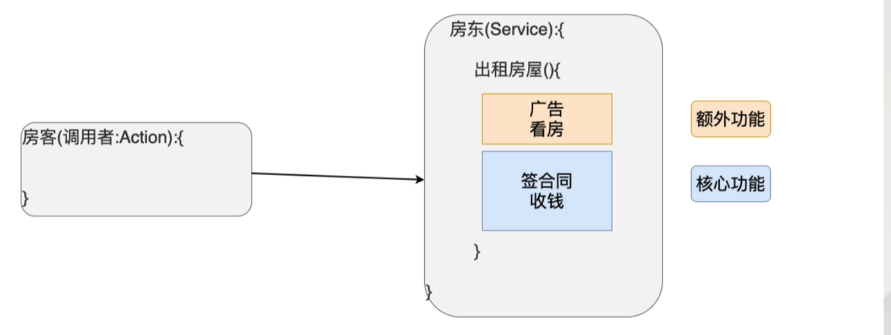
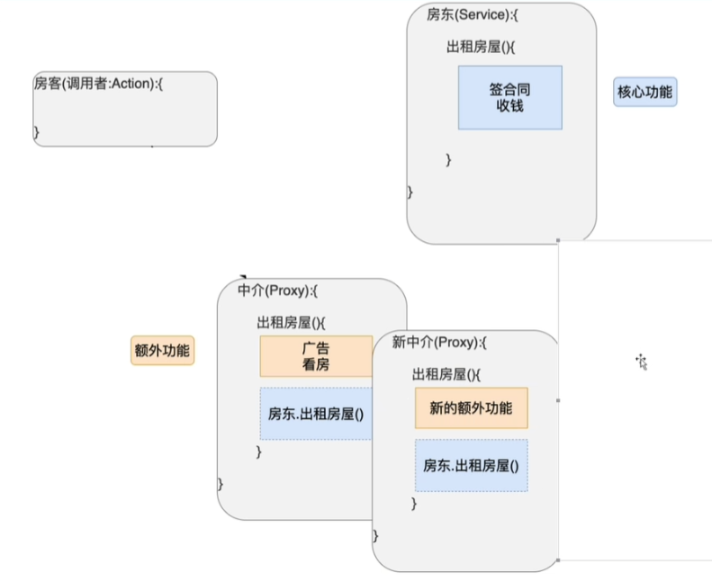
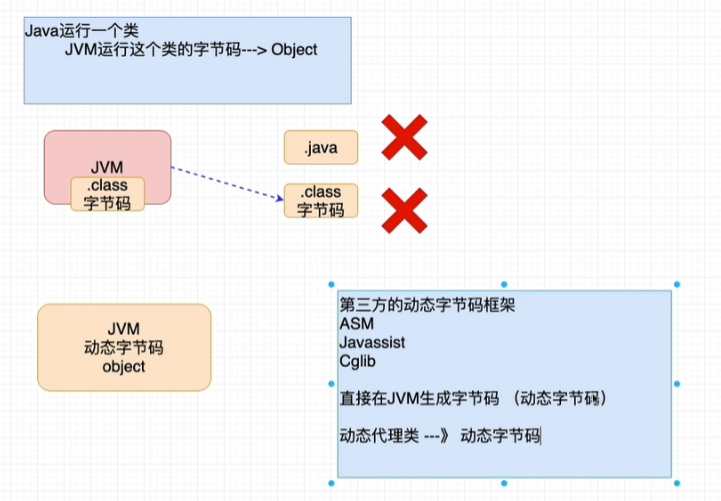
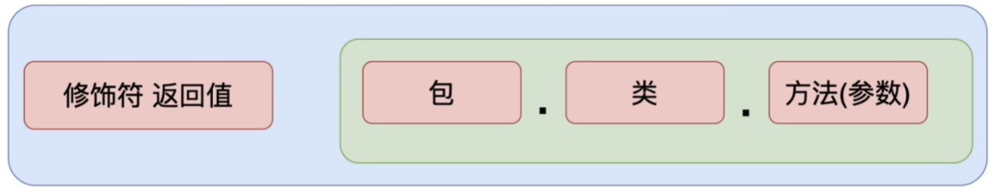
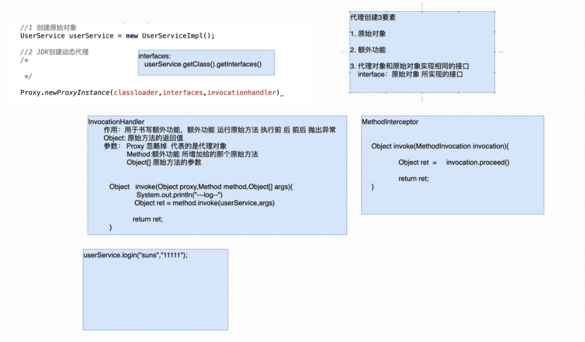
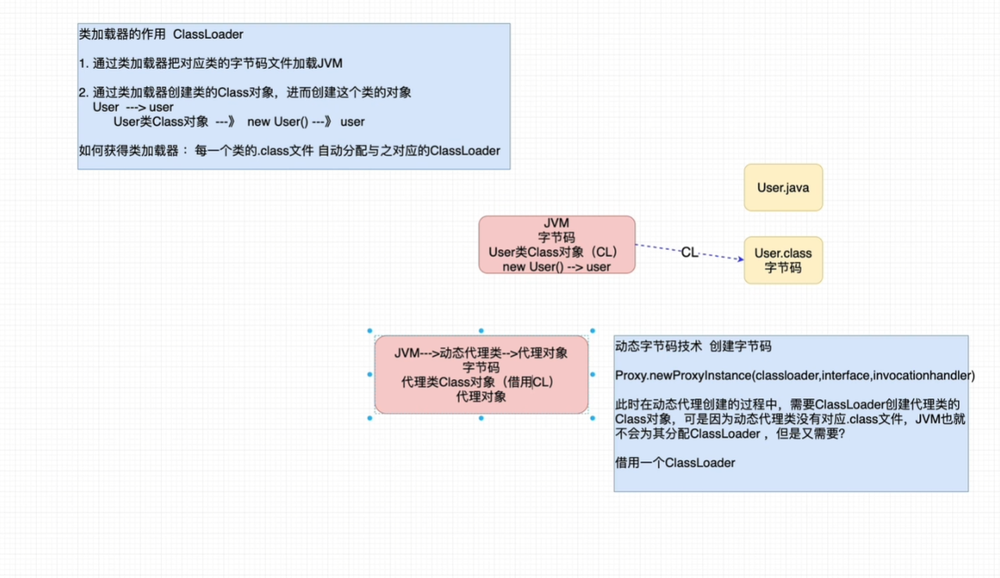
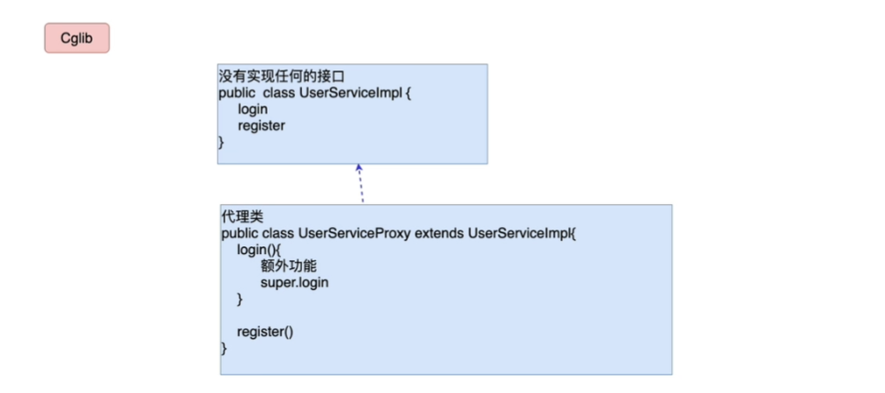
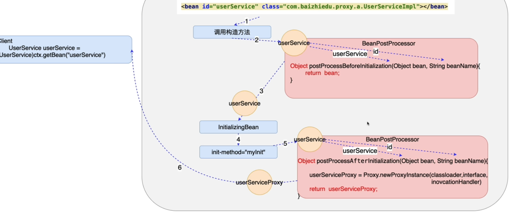
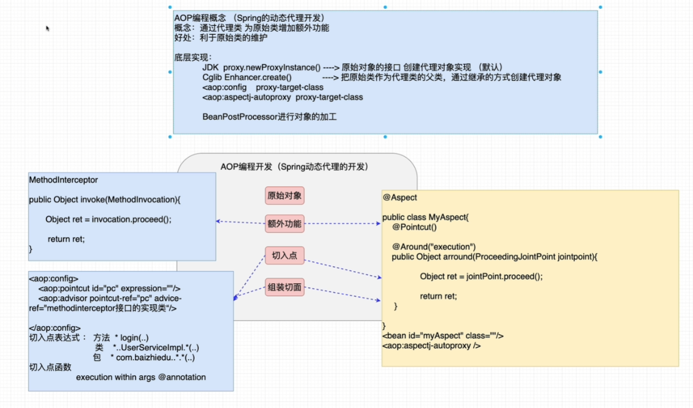

---

title: 回炉重造之Spring(二)
cover: banner.jpg
top_img: /img/tags_index.jpg
tags:
  - Spring
abbrlink: 17180
date: 2022-12-28 15:43:44

---

### 前言

本章主要介绍Spring的AOP编程

### 静态代理设计模式

静态代理：为每一个原始类，手工编写一个代理类(.java .class)

#### 为什么需要代理设计模式？

 在Service层中我们把代码分为额外功能和核心功能，核心功能就是具体的业务逻辑以及DAO操作，但额外功能就是可有可无且代码较少的功能例如日志、事务等，这些额外功能书写在Service层会出现一个矛盾：

```markdown
站在Service层的调用者(Controller)的角度看：需要在Service层书写额外的功能
站在软件设计者的角度来看：Service层的功能可有可无那我就喜欢他没有，当需要的时候再去添加
```

现实生活中的一个具体案例：



现实生活中房客去租房的时候需要房东作为软件设计者去实现额外功能，因为没有广告看房的话房客就没法看房进而签合同。但是房东又不想一直去打广告，因为房东平时也可能有自己的事，房东只想去签合同，因此我们需要一种改造方案来解决这种矛盾，这种解决方案就是中介或者称为代理。



当出现这种矛盾的时候，把一方需要但另一方不想做的时候交给中间方代理来做，这样的好处不仅可以解耦，而且还可以在Service方想更换新的中介的时候直接通过配置的方法来更换且新增代码即可，无需修改原来的代码。又一次体会到了开闭原则。

#### 代理设计模式

概念：通过代理类，为原始类或称目标类(Service)增加额外的功能

好处：利于原始(目标)类的维护 只需新增无需修改

目标类 原始类：业务中指的是业务类 负责业务运算 DAO调用

目标方法 原始方法：目标类或原始类中的方法 

附加功能(额外功能)：日志 事务 性能

代理开发中的核心要素：代理类 = 目标类 + 额外功能

转换的到开发中的实际应用就是，当我们定义一个UserService的接口以后，具体的业务逻辑和DAO调用全部在UserServiceImpl中完成，而代理类UserServiceProxy也要实现UserService接口来形成相同的方法名称，因为只有这样才能”迷惑“调用者，以此达到看似相同服务的功能

编码实现：

定义UserService接口

```java
public interface UserService {
    void login();
}
```

实现UserServiceImpl

```java
public class UserServiceImpl implements UserService {
    @Override
    public void login() {
        System.out.println("UserService-Login");
    }
}
```

实现代理类 

```java
public class UserServiceProxy implements UserService {
    //应该让Spring工厂来创建 这里方便测试就不解耦了
    private UserServiceImpl userService = new UserServiceImpl();
    @Override
    public void login() {
        System.out.println("-----------log--------------"); //实现核心功能 添加日志
        userService.login();
    }
}
```

测试

```java
@Test
public void test1(){
    UserService userService = new UserServiceProxy();
    userService.login();
}
```

#### 静态代理的缺点

静态类文件数量过多，不利于项目管理，如果存在100个原始类就有100个代理类，从功能上来说有必要因为都要实现额外的功能，但从设计的角度上来说没有必要，因为例如日志这样的操作在每一个代理类中都需要实现，这样冗余变大，不利于管理

代理类中 额外功能修改复杂

### Spring动态代理的开发

动态代理概念和静态代理完全一直，但好处是利于原始类的维护

#### 动态代理开发步骤

引入依赖

```xml
<dependency>
    <groupId>org.springframework</groupId>
    <artifactId>spring-aop</artifactId>
    <version>5.1.4.RELEASE</version>
</dependency>
<!-- https://mvnrepository.com/artifact/org.aspectj/aspectjrt -->
<dependency>
    <groupId>org.aspectj</groupId>
    <artifactId>aspectjrt</artifactId>
    <version>1.8.8</version>
</dependency>
<!-- https://mvnrepository.com/artifact/org.aspectj/aspectjweaver -->
<dependency>
    <groupId>org.aspectj</groupId>
    <artifactId>aspectjweaver</artifactId>
    <version>1.8.3</version>
</dependency>
```

开发步骤：

创建原始对象并配置bean

```java
public class UserServiceImpl implements UserService {
    @Override
    public void login() {
        System.out.println("UserService-Login");
    }
}
```

```xml
<bean id="userServiceImpl" class="com.sammie.basic.service.impl.UserServiceImpl"/>
```

提供额外功能 MethodBeforeAdvice接口，其实现方法会在我们的普通方法即login方法之前运行，同时由配置Spring配置文件进行注册

```java
public class UserDynamic implements MethodBeforeAdvice {
    /**
     * 作用：需要把核心功能之前的额外功能 书写在before当中
     * @param method
     * @param objects
     * @param o
     * @throws Throwable
     */
    @Override
    public void before(Method method, Object[] objects, Object o) throws Throwable {
            //额外功能 打印日志
        System.out.println("------before log------");
    }
}
```

```xml
<bean id="userDynamic" class="com.sammie.basic.dynamic.UserDynamic"/>
```

定义切入点

```markdown
切入点：额外功能加入的位置 例如日志功能可能在多个代理类中进行使用
目的：由程序员根据自己的需要，决定额外功能加入到哪个原始方法
实际应用：例如增删改都需要事务 但查询是不需要事务
expression 表示切入点表达式 表达式内的参数是所有方法都执行添加额外功能 具体表达式内容后续介绍
```

```xml
<aop:config>
    <aop:pointcut id="pc" expression="execution(* *(..))"/> 
</aop:config>
```

组装（把第二步和第三步整合） 表达的含义是所有的方法 都加入before的额外功能

```xml
<aop:config>
        <aop:pointcut id="pc" expression="execution(* *(..))"/>
        <aop:advisor advice-ref="userDynamic" pointcut-ref="pc"/>
</aop:config>
```

调用 

目的：获得Spring工厂创建的动态代理对象，并进行调用

注意：Spring的工厂通过原始对象的id值获得的是代理对象而不是原始对象，ctx.getBean获得的代理对象可以通过声明接口类型来进行对象的存储，其原理是代理类要和原始类一样实现相同的接口，因此可以通过向上转型的方式用接口来存储

```java
@Test
public void test2(){
    ClassPathXmlApplicationContext ctx = new ClassPathXmlApplicationContext("/applicationContext.xml");
    UserService userService = (UserService) ctx.getBean("userServiceImpl");
    userService.login();
}
```

#### 动态代理细节分析

Spring创建的动态代理类在哪里？

```markdown
Spring框架在运行时，通过动态字节码技术，在JVM创建，运行在JVM内部，等程序结束后，会和JVM一起消失，我们在代码中是看不到这个代理类的，但是可以通过Debug观察到类型是${Proxy}

Spring中通过第三方的动态字节码框架直接生成字节码加入到JVM中，而不需要像平常一样由.java文件生成字节码文件以后加入JVM，这样的好处是解决静态代理的文件数量问题，利于项目的维护
```



动态代理编程简化代理的开发

通常我们只需要做到创建原始类、额外的类实现MethodBeforeAdvice，定义切入点，最后进行组装，在对所有类都添加额外方法表达式的前提下，下一次需要对一个原始类（例如OrderServiceImpl）新增额外功能的时候，只需要注册一次bean到Spring工厂中即可，无需修改原有的代码。

因为设计了代理模式，因此当我们不喜欢原有的before的时候，只需要注释掉原有的bean转而实现一个新的before然后注册进Spring即可，满足开闭原则

### 动态代理详解

#### 额外功能详解

MethodBeforeAdvice接口

```markdown
MethodBeforeAdvice接口作用：额外功能运行在原始方法执行之前，进行额外功能操作
参数
Method:额外功能所增加给的那个原始方法 login
Object[]:额外功能所增加的那个原始方法的参数 String name String password
Object:额外功能所增加的那个原始对象 UserServiceImpl OrderServiceImp
```

MethodInterceptor接口

```markdown
MethodInterceptor(方法拦截器)
MethodBeforeAdvice -> 原始方法执行之前
MethodInterceptor  -> 原始方法之前、原始方法之后 原始方法执行之前 之后均可
```

```java
public class UserDynamic2 implements MethodInterceptor {
    @Override
    public Object invoke(MethodInvocation methodInvocation) throws Throwable {
        System.out.println("执行methodInvocation");
        Object res = methodInvocation.proceed();//执行原始类的方法 且返回给Spring 因此想做的操作可以在这一行之前也可以之后在做
        return res;
    }
}
```

```xml
<bean id="userDynamic2" class="com.sammie.basic.dynamic.UserDynamic2"/>
<aop:config>
        <aop:pointcut id="pc" expression="execution(* *(..))"/>
        <aop:advisor advice-ref="userDynamic2" pointcut-ref="pc"/>
</aop:config>
```

额外功能运行在原始方法抛出异常的时候

```java
public Object invoke(MethodInvocation methodInvocation) throws Throwable {
    Object res = null;
    try {
        res = methodInvocation.proceed();//执行原始类的方法 且返回给Spring
    } catch (Throwable e) {
        System.out.println("-----这里执行抛出异常以后的额外功能------");
        e.printStackTrace();
    }
    return res;
}
```

细节：

- 如果把原始方法的返回值直接作为invoke方法的返回值，MethodInterceptor不会影响原始方法的返回值，但如果在拿到原始方法的返回之后，return的是其他值，则调用者最后拿到的也是其他值
- 实际开发中一般使用的是MethodInterceptor而不是MethodBeforeAdvice，因为更灵活

#### 切入点详解

切入点表示额外功能添加的具体位置

方法切入点：

切入点表达式

切入点表达式通过类似正则的方法来把不同的额外功能匹配给不同的原始方法，其具体语法为:修饰符 返回值|方法名|参数表，例如 * *(..)，表示对修饰符返回值、方法名、参数表、以及参数都没有要求

案例：

只定义login方法作为切入点

```xml
<aop:pointcut id="pc" expression="execution(* login(..))"/>
```

定义register方法且方法有两个字符串类型的参数 作为切入点。

```xml
<aop:pointcut id="pc" expression="execution(* register(String,String))"/>
```

细节：

注意这里有个超级大的坑，就是如果下面的两个String改成一个String，那么就无法匹配上我们的register方法，因为register方法是定义的两个字符串参数，但是这种情况下getBean获得的对象是原始类而不是像前文提到的那样是代理类对象！

如果参数列表中的参数使用的是非java.lang包下的类型，必须使用全限定类名

参数列表可以用可变参数 例如(String,..)表示第一个参数是String，后面有没有参数或者任意类型的参数均可以

上面这种方式的切入点并不精确，需要进行改进，例如a包和b包下都有UserServiceImpl其中既有同名方法也有不同名方法，但只想匹配a包下的实现类，则需要包名来进行匹配，完整的匹配规则应该如下图所示：



类切入点：

类切入点的定义是把类作为切入点，这样可以把整个类中的所有方法都加上额外功能

语法1：把类中所有的方法都加入额外功能

```xml
<aop:pointcut id="pc" expression="execution(* com.sammie.basic.service.impl.UserServiceImpl.*(..))"/>
```

语法2：把不同包中相同类的所有方法都加入额外功能 (如果采用这种方式的结构最多只能处理一层包，因此此时的UserServiceImpl应该放到com包下)，但正常情况下来说不能这样，所以表达式里要有两个点来忽略包

```xml
<aop:pointcut id="pc" expression="execution(* *..UserServiceImpl.*(..))"/>
```

包切入点：

如果想把一个包下的所有类的所有方法都加入额外功能，就可以使用包切入点表达式

语法1：切入点包中的所有类，但必须在impl包中，不能在impl包的子包中，需要子包也包含在其中需要两个点

```xml
<aop:pointcut id="pc" expression="execution(* com.sammie.basic.service.impl..*.*(..))"/>
```

实际开发中一般都使用包切入点

#### 切入点函数

execution

作用：主要用于方法参数的匹配 

切入点：方法参数必须是2个字符串类型的参数

args

args(String,String)

作用：主要用于方法参数的匹配 

切入点：方法参数必须是2个字符串类型的参数

args(String,String)

within

作用：主要用于进行类、包切入点表达式的匹配

切入点：UserServiceImpl这个类

within(*..UserServiceImpl)

@annotation

作用：为具有特殊注解的方法加入额外功能，例如自定义注解@MyLog

```java
@Target(ElementType.METHOD)
@Retention(RetentionPolicy.RUNTIME)
public @interface MyLog {
}
```

```java
@MyLog
@Override
public void login() {
    System.out.println("UserService-Login");
}
```

```xml
<aop:pointcut id="pc" expression="@annotation(com.sammie.basic.annotaiton.MyLog)"/>
```

切入点函数的逻辑运算

指的是 整合多个切入点函数一起配合工作，，进而完成更为复杂的需求

and与操作

案例：login 同时 参数 2个字符串
execution(* login(String,String))
execution(* login(..) and args(String,String))

细节：与操作不能用于同种类型的切入点函数 如execution and execution 是不行的

作用：处理复杂操作 例如只切入UserServiceImpl中的login和register，如果存在其他函数则原有的方式已经不满足要求，此外也不能用 execution(* login()..) and execution(* register()..)来操作，因为这种模式表达的是一个同时叫login和register的方法，事实上肯定不能存在一个方法有两个名称。应该使用or操作

or或操作

可以任意一个函数满足的操作用or表示，就如同上述的操作应该用下面的表达式:

execution(* login(..)) or execution(* register(..))

### AOP编程

AOP(Aspect Oriented Programing) 面向切面编程，以切面为基本单位的程序开发，通过切面间的彼此协调，互相调用，完成程序的构建，切面 = 切入点 + 额外功能，AOP编程的一个实际应用就是Spring动态代理开发，AOP是OOP编程的一种补充，无法取代OOP。

### AOP底层实现原理

核心问题

```markdown
AOP如何创建动态代理类(动态字节码技术)

Spring工厂如何加工创建代理对象
```

#### 动态代理类的创建

Spring通过MethodInterceptor来帮助我们进行动态代理，但是其底层是采用了两种动态代理的方式进行的实现，分别是JDK和CGlib的方式。

JDK的动态代理

JDK提供了Proxy这个代理类来进行动态代理，可以用newProxyInstance来创建代理类，主要参数是invocationHandler接口，这个接口体现了方法执行的三要素即对象、方法、方法参数，对象由method.invoke来通过反射创建，newProxyInstance中的interfaces参数用于原始对象所实现的接口

通常情况下类加载器ClassLoader主要用来把class字节码加载到JVM中，同时再创建类的Class对象，最终我们才能使用new的方式创建对象。动态代理中由JVM生成动态代理类，最终生成代理对象，但这种方式是不存在class和java文件的，由动态字节码技术实现，直接写入JVM，此时代理类的Class对象需要ClassLoader来创建class对象，但原来是有.class文件才可以创建的class对象，此时没有class文件，那就没办法自动分配ClassLoader，那么此时就要借用一个ClassLoader来创建class对象。






```java
public class JDKUserServiceProxy {
    public static void main(String[] args) {
        final UserServiceImpl userService = new UserServiceImpl();
        InvocationHandler invocationHandler = new InvocationHandler() {
            @Override
            public Object invoke(Object proxy, Method method, Object[] args) throws Throwable {
                System.out.println("额外功能执行在原始方法之前");
                Object ret = method.invoke(userService, args);
                return ret;
            }
        };
        UserService service = (UserService) Proxy.newProxyInstance(JDKUserServiceProxy.class.getClassLoader(), userService.getClass().getInterfaces(), invocationHandler);
        service.login();
        service.register("sammie","123");
    }
}
```

CGlib的动态代理

CGlib主要用来解决没有实现任何接口的原始类来创建动态代理，其使用继承的原始类的方法来实现，因为继承也可以重写父类相同名称的方法。



```java
public class CGlibUserServiceProxy {
    public static void main(String[] args) {
        //创建原始对象
        UserServiceImpl userService = new UserServiceImpl();
        //使用cglib的方式创建动态代理对象
        /**
         * cglib和jdk创建动态代理的方式大致相同 只是不用实现接口而是要父类
         * cglib需要一个额外功能 在方法拦截器接口中实现方法
         */
        Enhancer enhancer = new Enhancer();
        enhancer.setClassLoader(userService.getClass().getClassLoader());
        enhancer.setSuperclass(userService.getClass());
        MethodInterceptor methodInterceptor = new MethodInterceptor(){
            @Override
            public Object intercept(Object o, Method method, Object[] args, MethodProxy methodProxy) throws Throwable {
                System.out.println("执行额外功能");
                Object ret = method.invoke(userService, args);
                return ret;
            }
        };
        enhancer.setCallback(methodInterceptor);
        UserService service = (UserService) enhancer.create();
        service.login();
        service.register("sammie","123");
    }
}
```

#### 复习BeanPostProcessor
在最开始学习Spring的时候介绍过BeanPostProcessor可以处理由Spring处理以后的对象，结合动态代理可以创建出代理类，一半回在Afer中实现动态代理然后返回给Spring最终得到动态代理对象,Spring也采用的是这种方式，但更复杂，因为还要引入切入点。



```java
public class PostBeanFactoryProxy implements BeanPostProcessor {
    @Override
    public Object postProcessBeforeInitialization(Object bean, String beanName) throws BeansException {
        return bean;
    }

    @Override
    public Object postProcessAfterInitialization(Object bean, String beanName) throws BeansException {
        //实现动态代理
        InvocationHandler invocationHandler = new InvocationHandler(){
            @Override
            public Object invoke(Object proxy, Method method, Object[] args) throws Throwable {
                System.out.println("执行的是额外日志功能");
                Object ret = method.invoke(bean, args);
                return ret;
            }
        };
        return Proxy.newProxyInstance(PostBeanFactoryProxy.class.getClassLoader(),bean.getClass().getInterfaces(),invocationHandler);
    }
}
```

```xml
<bean id="userServiceImpl" class="com.sammie.basic.service.impl.UserServiceImpl"/>
<bean id="postBeanFactoryProxy" class="com.sammie.basic.factoryBean.PostBeanFactoryProxy"/>
```

### 基于注解的AOP编程

基于注解的形式和原生配置的形式步骤大致相同，只是把一部分代码转换成注解的形式。通过把额外功能、切入点、组装三部分内容放到一个切面类中进行配置来实现动态代理。

#### 注解AOP编程实现

```java
@Aspect
public class AnnotaionAopTest {
    /**
     *
     * @param joinPoint 与MethodInvocation一致 原始方法
     * @return
     * @throws Throwable
     */
    @Around("execution(* login(..))")
    public Object arround(ProceedingJoinPoint joinPoint) throws Throwable {
        System.out.println("额外功能执行在代理方法之前");
        Object ret = joinPoint.proceed();
        System.out.println("额外功能执行在代理方法之后");
        return ret;
    }
}
```

```xml
<bean id="userServiceImpl" class="com.sammie.basic.service.impl.UserServiceImpl"/>
<bean id="annotaionaoptest" class="com.sammie.basic.aspect.AnnotaionAopTest"/>
<aop:aspectj-autoproxy/>
```
#### 注解AOP编程细节

切入点复用

在日常使用中，如果每次都直接使用@Around注解，可能会导致需要新增功能的时候再写表达式，出现代码冗余，同时如果需要修改成其他方法，表达式难以维护。因此需要用一个方法抽象出表达式，添加@PointCut注解，注意这里是代码复用不是解除耦合

```java
@Aspect
public class AnnotaionAopTest {

    @Pointcut("execution(* login(..))")
    public void pointCut(){}

    @Around(value = "pointCut()")
    public Object arround(ProceedingJoinPoint joinPoint) throws Throwable {
        System.out.println("额外日志功能执行在代理方法之前");
        Object ret = joinPoint.proceed();
        System.out.println("额外日志功能执行在代理方法之后");
        return ret;
    }


    @Around(value = "pointCut()")
    public Object arround1(ProceedingJoinPoint joinPoint) throws Throwable {
        System.out.println("额外事务功能执行在代理方法之前");
        Object ret = joinPoint.proceed();
        System.out.println("额外事务功能执行在代理方法之后");
        return ret;
    }
}
```

JDK和CGlib切换

默认情况下AOP编程底层用的是JDK动态代理的创建方式，可以在配置文件中通过指定proxy-target-class为true转换为CGlib的方式。而如果是传统的配置的方法进行AOP开发来切换CGlib需要在配置文件中的aop:config中指定proxy-target-class为true

```xml
<aop:aspectj-autoproxy proxy-target-class="true"/>
```

```xml
<aop:config proxy-target-class="true"></aop:config>
```

### AOP开发中的坑

代理对象调用的问题

在AOP开发中有时候会在同一个Service中的A方法里调用B方法(都在一个Service中)，此时如果用this.B()的方式调用的是原始的核心方法而不是代理对象方法，就不会有我们所需要的额外功能，因此需要在Service中通过ApplicationContext来拿到Spring的代理对象，具体方法是在Service的实现类中实现ApplicationContextAware接口

```java
public class UserServiceImpl implements UserService, ApplicationContextAware {
    private ApplicationContext ctx;
    @Override
    public void login() {
        System.out.println("UserService-Login");
    }

    @Override
    public void register(String name,String password) {
        System.out.println("UserService-Register");
        //调用代理对象的login方法
        UserService userServiceImpl = (UserService) ctx.getBean("userServiceImpl");
        userServiceImpl.login();
    }

    @Override
    public void setApplicationContext(ApplicationContext applicationContext) throws BeansException {
        this.ctx = applicationContext;
    }
}
```

### AOP开发知识总结


