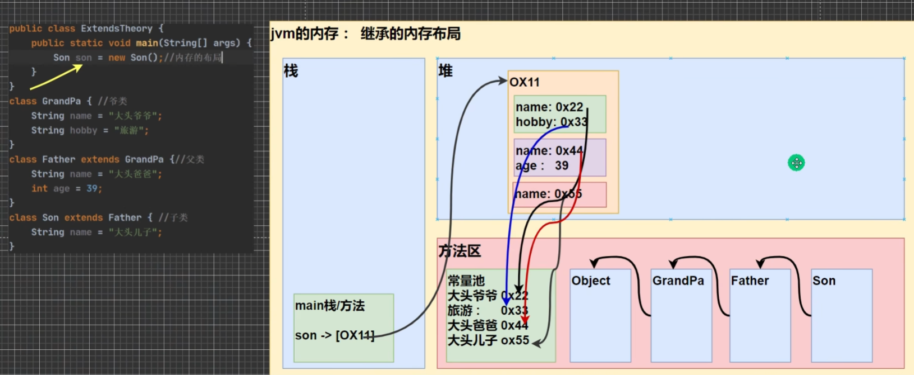

### 面向对象编程
面向对象是将所有的具体类抽象的过程，例如猫和狗可以抽象成动物类，再比如猫1和猫2可以抽象成猫类,这样的好处是避免原来面向过程大量的代码冗余,提高数据管理效率。

### 类与对象
由于原有的定义方式不满足新的需求，因此推出了类和对象的概念，一个类可以有很多个对象，一个对象主要包含属性(成员变量)和行为。属性如果不赋值会有默认值，规则于数组类型相同。对象名称其实是一种引用，因此可以让两个对象指向同一个地址空间。
```java
class Cat{
    String catName;
    int age;
    String color;
}
Cat cat1 =  new Cat();
cat1.name = "小白";
//对象在内存的存储分析：
//首先new会在栈中开辟一个空间用于存放cat变量，然后指向堆内的一个连续地址，
//堆内的第一个地址和第三个地址会指向方法区常量池的两个地址用于存放字符串，如果有方法也会直接放到方法区当中
//int类型因为是基本数据类型会直接放到堆里面。
```
### 成员方法
对于类来说，成员方法就是这个类需要进行的动作，例如人可以跑步，猫可以跳跃等等，同时成员方法也可以将冗余的代码进行抽象，从而形成代码复用。

以简单求和举例，成员方法首先会在栈中开辟一个独立空间(main栈)，然后给p开一个空间以后再在堆里面开一个空间，地址回填给p，然后再在栈当中开一个属于getSum的独立空间，这个地址回填给main栈中的getSum,getSum栈当中会把10和20进行值拷贝，计算出的结果给res，return的时候会返回到p.getSum并赋值给result。
```java
Person p = new Person();
int result = p.getSum(10,20); //这个叫实参

public int getSum(int num1,int num2){ //这里的叫形参 内存中是值拷贝的形式
	int res = num1 + num2;
	return res;  //注意返回的变量类型和定义的返回类型必须相同
	//如果有定义必须用return返回
}
```
注意事项：同一个类当中的方法直接调用即可无需创建对象，跨类中的方法A调用B类方法需要同对象名调用，注意能否访问得到得看访问修饰符和包。

#### 成员方法传参
基本数据类型传参:由于不同方法在不同的栈当中，因此不同方法的相同名称的变量在内存中实际上是不同地址，故而形参和实参并不会直接关联。
引用类型传参：在引用类型当中，传递的参数是地址，因此在形参中修改变量就会引起原变量的变化，但是形参是副本，如果将形参置为NULL，并不会影响原来的变量，因为形参只是断了和原变量的联系。

#### 方法重载
Java中允许同一个类中，存在相同方法名称的方法，但要求参数列表不同，返回值没有要求

```java
public int add(int num1,int num2){
	return num1 + num2;
}
public double add(double num1,double num2){
	return num1 + num2;
}
```
可变参数
Java允许将一个类中多个同名同功能但参数个数不同的方法，封装成一个方法。

```java
//实现计算2、3、4个数的和的方法
public int sum(int ...nums){
	//int... 表示接受的是可变参数 类型是int 即多个int 0-n个
	//使用可变参数时 可以当作数组使用 本质就是数组 形参也可以是数组
	System.out.println("接收到的参数长度:",nums.length);
	int res = 0;
	for(int i = 0;i<nums.length;i++){
		res += nums[i]
	}
	return res;
}
```
细节：

- 一个形参列表最多只能出现一个可变参数
- 可变参数可以和其他普通参数放在一起，但必须保证可变参数在形参列表的最后

### 作用域

在Java编程中，主要的变量就是属性(成员变量、全局变量)和局部变量，这里所指的局部变量主要指的是在成员方法中定义的变量（还有在代码块中定义的），作用域的分类：全局变量和局部变量，全局变量可以不赋值直接使用因为含有默认值，局部变量必须赋值以后才能使用因为没有默认值

细节：

- 全局变量和局部变量可以定义相同类型和名称的变量，遵守就近原则，离谁近就访问谁
- 属性的生命周期较长，伴随对象的销毁而销毁，局部变量生命周期较短，伴随代码块的销毁而销毁
- 全局变量可以加修饰符，局部变量不可加修饰符

### 构造方法(构造器)

构造方法主要用来在对象实例化的时候注入属性的值完成对象初始化，构造器的修饰符可以默认、public、protected、private，构造器没有返回值，方法名和类名相同，参数列表和成员方法一样的规则，构造器由系统调用。

```java
public class ConstructorDemo {
    public static void main(String[] args) {
        Person sammie = new Person("sammie", 24);
        System.out.println(sammie.name);
        System.out.println(sammie.age);
    }
}

class Person {
    String name;
    int age;
    public Person(String name, int age) {
        this.name = name;
        this.age = age;
    }
}
```
细节：

- 构造方法本质上也是一种方法，因此也可以重载
- 如果不写构造方法，系统会自动生成一个默认的构造方法，也称默认无参构造器
- 一旦自定义了自己的构造器，就会覆盖原有系统生成的构造器，不能再使用系统生成的默认构造器，除非显示的定义一个无参构造器

### this关键字

在构造器中的形参是局部变量，需要使用this关键字来指定当前的属性名称。this指向的是当前的对象，即在哪里使用this，this就指向对应方法的对象。this的本质是在对象内生成的一个成员属性，其值是对象的地址，指向对象本身。

this可以访问本类的属性、方法、构造器，访问构造器的时候注意只能在构造器中使用this访问另一个构造器，this不能在类的外部使用。

### 访问修饰符

public：公开级别，表示对外公开

protected：受保护级别，对子类和同一个包中的类公开

无修饰符：默认级别，同一个包中的类公开

private：只有类本身可以访问，不对外公开

类的定义只能是默认或者public，保护和私有是错误的定义方式

### 封装
面向对象的三大特征：封装、继承、多态

封装是指把属性和方法封装在一起，数据被保护在其内部，程序的其他部分只能通过被授权的方法才能对数据进行操作(例如name 和setName方法)，这样做的好处是可以隐藏实现细节同时对数据进行验证，保证安全合理。具体的实现思路是把属性私有化，然后提供一个公开的方法进行操作属性。

### 继承

继承是把拥有相同属性和方法的类抽象成一个公共的父类，然后通过继承自父类的属性和方法来生成新的子类，一个案例是一个大学生和小学生，其都是学生，拥有身高、学号等相同属性，可以抽象出一个公共的父类学生类。以此实现代码复用。

```java
public class Student {
    protected int studentNum;
    protected int hight;
}
```

```java
public class Pupil extends Student{
}
```

```java
public class Graduate extends Student{
}
```

细节：

子类会继承所有父类的属性和方法，非私有的属性和方法可以直接在子类访问，但私有的属性和方法需要通过公开方法来进行访问

子类必须调用父类的构造器，完成父类的初始化，不写的话默认有super

创建子类时，如果父类有有参构造，无论使用子类的哪个构造器，都要求父类有无参构造器，否则要求在子类中使用super指定使用父类的哪个构造器完成初始化，否则编译不通过。

super使用时，需要放在构造器的第一行,且只能在构造器中使用

super和this都只能在构造器的第一行，因此一个构造器不能同时出现这两个方法

Java中所有类都是Object的子类

父类构造器的调用不限于直接父类，会一致向上追溯到Object类

Java中的类是单继承机制，但可以多实现，例如接口

#### 继承的本质



继承的本质是创建了一种查找关系，访问属性从底层向高层顺序查找可访问属性。不同层级的类的属性在内存中的堆里有不同的地址。

#### super

super可以访问父类的属性和方法，但不能父类的私有属性和方法，保护模式可以访问的到。

super的查询顺序是从本类开始，往上层查找，找到以后如果不是私有则直接调用，私有则报错，没找到提示方法不存在。使用super.父类方法()会跳过查找本类

super不能super.super直接访问爷爷类 只能先访问父类再访问爷爷类

### 方法重载

方法重载(重写)就是子类覆盖父类的相同方法。

#### 细节

子类方法的参数、方法名称，要和父类方法的参数、方法名称完全相同

子类方法的返回类型和父类方法返回类型一样，或者是父类返回类型的子类，如父类返回Object,子类返回String

子类方法不能缩小父类方法的访问权限，例如不能从public到private

### 多态

多态的作用是解决代码复用中的相同父类实现的问题，例如要求给不同的动物进行喂食，传统方法就需要抽象出动物类、食物类以及下属的猫狗、大棒骨猫粮等下级类,但在主类中使用这些类的时候进行喂食方法要写很多次。使用多态可以让父类进行不同的子类实现。多态是一种编程思想，其本身基于继承和封装。多态主要分为方法多态和对象多态，方法多态体现在重载中，相同名称的方法但形参列表不同，或是相同名称的方法但对象不同。

#### 对象多态  

对象多态是整个多态的核心。规则：

一个对象的编译类型和运行类型可以不一致

编译类型在定义对象时，就确定了，不能改变。

运行类型是可以变化的

编译类型看定义时等号的左边，运行类型看等号的右边

```java
Animal animal = new Dog(); //animal编译类型是Animal，运行类型是Dog
animal.cry(); //调用的是Dog类的cry
```

```java
animal = new Cat(); //animal的运行类型变化成Cat 但编译类型是Animal
animal.cry();// 注意此时会调用Cat的cry
```

 解决前面提到的喂食问题，使用多态可以解决当新的food和animal类出现的时候不修改原代码

```java
public void feed(Animal animal,Food food){
    System.out.println("主人" + name + "给" +  animal.getName() + "吃了" + food.getName());
}
```

#### 上下转型

向上转型：

本质是父类的引用指向了子类的对象。特点：可以调用父类中的所有成员（需要遵守访问权限），不能调用子类中特有的成员，最终的运行效果要看子类的具体实现。

```java
Animal animal = new Cat();
animal.catchMouse();//错误的 无法调用子类特有的方法
animal.eat();//正确的 运行是调用的是Cat的eat 编译时可通过 注意此时编译的eat是Animal类的eat 但运行时用的是Cat的 从子类开始找
```

向下转型：

语法：子类类型 引用名 =  (子类类型)  父类引用

只能强制转换父类的引用，不能强制转换父类的对象

要求父类的引用必须指向的是当前目标类型的对象

向下转型后可以调用子类类型中的所有成员

```java
Animal animal = new Cat();
Cat cat  =  (Cat) animal; // 注意此时原来的animal是依然指向一个Cat对象的，同时新的cat也指向这个Cat对象
cat.catchMouse();//调用子类中特有的方法
```

#### 属性重写问题

前面提到过如果有上下转型的时候，如果调用子类和父类都有的方法，那么编译可以通过且在运行时会用子类的方法。但属性则相反，在调用其相同属性名称的属性时，会看的是编译类型而不是运行类型。

```java
Base base = new Sub();
System.out.println(base.count); // 调用的是Base类中的count 
Sub sub = new Sub();
System.out.println(sub.count); // 调用的是Sub类中的count 
```

instanceof可以用于判断某个对象其**运行类型**是否是某某类型或者是某某类型的子类型

```java
Base base = new Sub(); //base编译类型是Base 运行类型是Sub
System.out.println(base instanceof Base); // true 本身且是父类型
System.out.println(base instanceof Sub); // true 子类型
```

#### 动态绑定机制(重要)

Java的动态绑定机制：

1.当调用对象方法的时候，该方法会和该对象的内存地址/运行类型绑定

2.当调用对象属性时，没有动态绑定机制，哪里声明，哪里使用。

```java
class Base{
    public int i = 10;
    public int sum(){ return getI()+10; }
    public int sum1(){ return i + 10; }
    public int getI(){ return i; }
}

class Sub extends Base{
    public int i = 20;
    //public int sum(){ return i+10; }
    //public int sum1(){ return i + 10; }
    public int getI(){ return i; }
}

//main方法中
Base base = new Sub();
System.out.println(base.sum());//30 其中getI调用的是Sub类的getI
System.out.println(base.sum1());//20  父类的i只使用父类的属性 不产生动态绑定机制 
```

#### 多态数组

多态数组是指数组的定义类型是父类类型，里面保存的实际元素类型是子类型。案例：现有一个父类Person以及两个子类Student，Teacher类型，现在要求把一个Person对象和2个Student对象以及2个Teacher对象放到一个数组当中，并调用父类继承的say方法。升级案例：如何调用子类特有的方法，例如Teacher类中的teach方法？

 ```java
 Person[] persons = new Person[5];
 persons[0] = new Person("jack",20);
 persons[1] = new Student("tom",20,100);
 persons[2] = new Teacher("ram",30,8000);
 for(int i = 0 ; i < persons.lenth; i++){
     System.out.println(persons[i].say());// 动态绑定 不同对象的say方法内容不同
     //调用特有方法
     if(persons[i] instanceof Student){
         Student student = (Student)persons[i];//向下转型
         student.study();//Teacher类同理
         //正常写法
         //((Student)persons[i]).study();
     }else if(persons[i] instanceof Person){
         //注意这一条的判断不能放在第一个if中 因为instanceof判断的是当前类和当前类的子类 放在第一条if中会导致下面的else if都执行
     } 
 }
 ```

多态参数：方法定义的形参为父类类型，实参类型允许为子类类型。第一种应用就是前面提到过的在喂动物食物的时候，定义的形参是Animal类，但传递的实参可以是Cat等子类类型。第二种应用是可以在子类和父类都定义同一个方法，子类重写以后在其他类中需要使用的时候可以不用向下转型而使用同一个方法。

### Object类

 Object类是所有类的超类，其实现了很多常用的方法。

#### ==和equals

老生常谈的面试问题了，==和equals方法都可以用来判断对象相等的问题，但是其具体实现不太相同。

==：既可以判断基本类型，又可以判断引用类型

==：如果判断基本类型，判断的是值是否相等，例如int i = 10; double d =10.0;

==：如果判断引用类型，判断的是地址是否相等，即判断是否是同一个对象


equals：是Object类中的方法，只能判断引用类型。默认判断的是地址是否相等，子类中往往重写该方法，用于判断**内容**是否相等，例如Integer,String的equals的重写。

#### hashCode

返回一个对象的哈希码值，该方法是为了提高哈希表的性能。hashCode的特性：

1.提高具有哈希结构的容器的效率

2.两个引用，如果指向的是同一个对象，则哈希值不同

3.两个引用，如果指向的是不同对象，则哈希值是不同的

4.哈希值主要根据地址号来的，不能完全将哈希值等价于地址

5.通常情况下hashCode配合业务（集合等）可能会进行重写

#### toString

返回该对象的字符串表示，默认返回：全类名+@+哈希值的16进制，一般情况下都要重写。直接输出对象会默认调用toString方法。

#### finalize

当垃圾回收器确定不存在对该对象的更多引用时候，由垃圾回收器调用此方法。(即销毁时调用)，主要用来做一些释放资源的操作。

垃圾回收机制的调用，由系统来决定，并不是对象无引用后立刻进行销毁,也可以通过Sytem.gc()来主动触发垃圾回收机制。

> tip:JDK9中被废除，官方不推荐使用

### 类变量和类方法

类变量和类方法是存在于一个类的所有对象共有的类和方法。

#### 类变量(静态变量)

设想一个问题，如果需要一个变量，当每次有新的对象生成了，该变量就要加一。这个问题可以通过在类中增加一个静态变量来解决

```java
class Demo{
    public static int totalNum = 0; //类变量
}
```

```mysql
System.out.println(Demo.totalNum); //使用类名+属性名访问
```

内存剖析：所有的static方法和变量在类创建的时候就会创建，其存放在方法区中，JDK8以后方法区移动到了堆当中，但不同的JDK厂商版本会有所不同，有些版本也会放在栈的方法区的静态域中。

注意：类变量是在类加载时就初始化了，即使没有创建对象，只要类加载了就可以使用类变量，类变量的声明周期是跟随类的声明周期。

#### 类方法

类方法和类变量相似，也是在一个类中共享的方法，调用方法和类变量一致。按照经验，一般一个方法里不涉及任何对象和成员的时候就可以设计成一个类方法提高效率。

```java
class Demo{
    public static void print(){System.out.println("test");}//类方法
}
```

类方法注意事项：类方法和普通方法都是随着类加载，结构信息存储在方法区，类方法中无this的参数，普通方法是含有this的参数的。类方法中不允许使用和对象有关的关键字，例如super和this。类方法只能访问静态变量或者静态方法。

 ### 代码块

代码块又叫初始化块，是类的一部分，通过{}包围起来，但和方法不同，没有方法名和返回，也没有参数，只有方法体，不用通过对象或者类显式调用，而是通过加载类时或者是创建对象时隐式调用。相当于另一种形式的构造器，**使用场景是多个构造器中有相同的代码，则可以抽象到代码块中提高代码效率，因为代码块会优先于构造器，其本身是在加载类的时候就执行了**。

```java
static {
    //代码
};
```

修饰符static可以省略，但如果要写上的话只能写static，使用了static的代码块叫做静态代码块,作用是随着类的加载而执行，并且只执行一次，普通代码块每次创建对象都会执行一次。分号可以省略。

**类什么时候会被加载：**

1.创建对象实例时 2.创建子类对象实例，父类也会被加载 3.使用类的静态成员时

如果只调用类的静态成员，普通代码块不会执行

**创建类时候的调用顺序：**

先调用静态代码块和静态属性初始化，按照定义顺序调用。然后调用普通代码块和普通属性的初始化，也按照定义顺序调用，最后调用构造方法。

构造器的最前面是隐藏了super()和调用普通代码块，静态相关的代码块，属性初始化，在类加载时，就执行完毕，因此是优先于构造器和普通代码块执行的。

```java
class A{
    public A(){
        super();
        //调用普通代码块
    }
}
```

**有继承关系的类创建对象时的成员调用顺序：**

1.父类的静态代码块和静态属性

2.子类的静态代码块和静态属性

3.父类的普通代码块和普通属性初始化

4.父类的构造方法

5.子类的普通代码块和普通属性初始化

6.子类的构造方法

### 单例设计模式

单例设计模式是静态方法和静态属性的经典使用。23种设计模式中的一种。所谓单例模式是指在整个软件系统中，某个类只存在一个对象实例，并且该类只提供一个取得其对象实例的方法。

#### 单例饿汉式

饿汉式的具体步骤：构造器私有化(防止直接new)、类的内部创建对象(创建私有对象)、向外暴露一个静态的公共方法(静态是保证不需要创建对象来调用 违反了单一对象原则)、代码实现。

之所以叫饿汉式是因为这种设计模式在类加载的时候就直接创建了对象，像饿汉一样很急。

#### 单例懒汉式

饿汉式存在一个问题就是一般需要加载的对象往往是重量级资源，但由于其本身是静态的私有属性，在其类加载的时候就会直接创建，而如果这种资源在后续的代码中没有使用到，则会造成资源的浪费。而懒汉式的区别就是只有在使用的时候才会创建。

```java
public class SingDemo {
    public static void main(String[] args) {
        //没使用Source类之前不会创建对象
        Source instance = Source.getInstance("D://test.txt");
    }
}

//资源类 用于测试单例模式
class Source{
    private String path;
    private static Source source;

    public Source(String path) {
        System.out.println("构造器调用");
        this.path = path;
    }

    public static Source getInstance(String path) {
        if (source == null){
            source = new Source(path);
        }

        return source;
    }

}
```

注意点：饿汉式和懒汉式创建对象的时机不同，饿汉式不存在线程安全问题，懒汉式则有线程安全的问题(原因在于不同的线程进入判断的时候可能还没有完成创建对象，从而可能存在多次创建对象，解决方案是加锁)。饿汉式存在浪费资源的可能性。

 ### final关键字

final关键字可以修饰类、属性、方法和局部变量。主要用来限制被修饰的类、属性等被修改。被final修饰的属性一般是常量，使用大写驼峰命名。

例如，不想父类被继承可以在父类加上final。

final修饰的属性在定义时必须赋值，并且以后不能修改，可以在定义、构造器、代码块中进行赋值。如果final修饰的属性是静态的，则初始化的位置只能是定义时或静态代码块中。

如果一个类不是final类，但含有final方法，则该方法虽然不能重写，但可以被继承。

final不能修饰构造器，并且与static一起使用，不会导致类加载,底层编译进行了优化。

### 抽象与多态

当子类需要继承父类的方法，但每次都需要重写相同方法的时候，例如动物类的子类猫类要去实现eat方法，这种时候就需要抽象出一个类来当父类。即父类声明，子类实现，应该把父类的方法设计成abstract方法，且父类也要变成抽象类。

```java
abstract class Animal{
    public abstrct void eat();
}
```

注意点：

1.抽象类是不能实例化的

2.抽象类可以不包含抽象方法，而且还可以有实现方法，构造器，静态属性等

3.一旦一个类包含了抽象方法，则这个类必须声明为抽象类

4.一个类继承了抽象类则必须重写所有方法，除非这个类自己也设计成抽象类

**抽象类的最佳实践----模板设计模式**

需求：有多个类，要完成不同的任务，要求统计得到各自完成任务的时间。

实现：抽象出一个公共父类Template，定义抽象方法job，以及计算时间的方法calculateTime，在calculateTime方法中包含了抽象方法job，不同的工作任务子类再继承父类后实现job即可。

### 接口

接口相比于继承来说可以多实现，而java本身只能但继承。可以定义一个接口，在不同的类里进行实现即可。使用的时候只需要接受一个接口类，但传入一个接口实现类即可。在接口中抽象方法不管写不写都是抽象方法。注意，从JDK1.8开始允许接口有默认实现方法，但需要使用default关键字标注。且可以使用静态方法

```java
public class Phone implements UsbInterface{
   //重写方法
}
```

```java
public interface AInterface{
    //属性
    public int n1 = 10;
    //默认方法
    default public void hi(){}
    public static void cry();
}
```

细节：

1.接口是不能被实例化的，因为接口本身是抽象的概念

2.接口中的所有方法均是public方法

3.一个普通类实现接口，需要实现接口中的所有方法，但抽象类可以不实现

4.一个类可以实现多个接口

5.接口中的所有属性都是 public static final修饰的，即采用接口.属性的方式进行访问

6.接口不能继承一般类，但可以继承别的多个接口

7.接口的修饰符只可以是public和默认


**接口也可以像继承一样进行多态，同时也可以进行多态数组**

```java
interface IF{}
class Monster implements IF{}
IF if01 = new Monster(); //向上
```

```java
//多态数组举例
interface Usb{}
class Phone_ implements Usb{}
class Camera_ implements Usb{}

//main..
Usb[] usbs = new Usb[2];
usbs[0] = new Phone_();
usbs[1] = new Camera_();
```

**接口多态传递**

```java
interface IH{}
interface IG extends IH{}
class Teacher implements IG{}


//main..
Ig ig = new Teacher();
IH ih = new Teacher(); //传递
```

