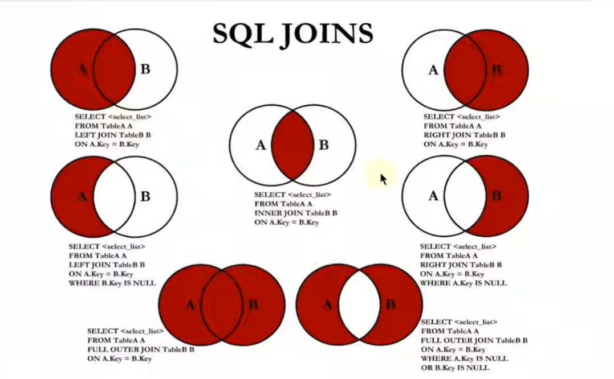
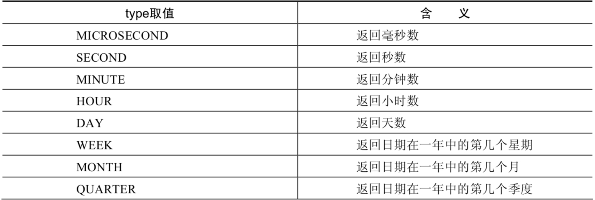
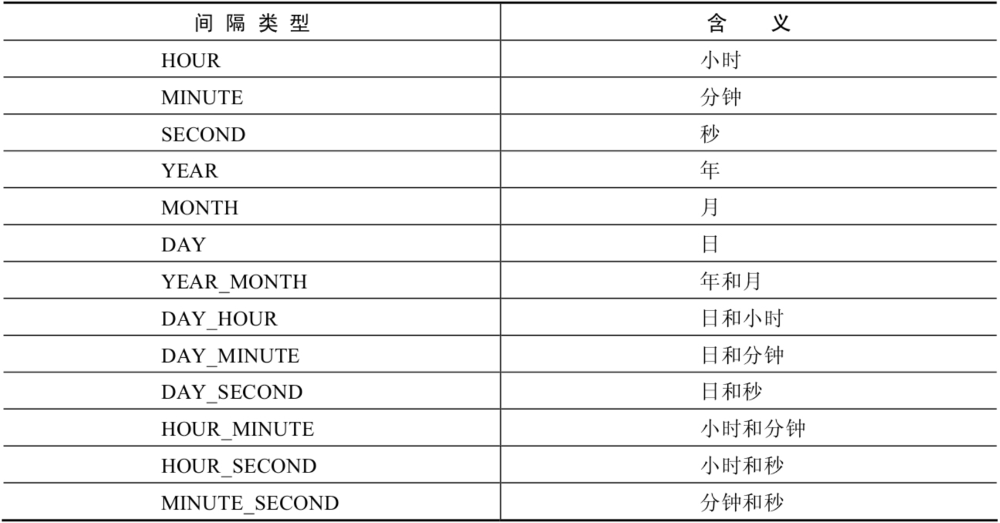
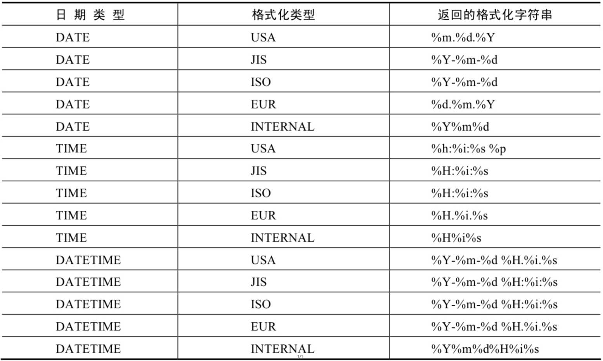

###  前言

本章主要介绍回炉重造MySQL的基础部分内容，由于这一次想全面认真的学习，因此MySQL作为重点也是会学习下高级部分例如索引的失效以及InnoDB、慢查询日志分析、行锁、间隙锁等内容，在更新MySQL的学习记录当中会持续更新MyBatis的内容，先简单过一遍MySQL，然后还要学习别的框架内容，特别是微服务的部分，因此高级部分会在学习完Java框架以后再补

### SQL分类

DDL：数据定义语言

CREATE、ALTER、DROP、RENAME、TRUNCATE等

DML：数据操作语言

SELECT、DELETE、UPDATE、INSERT等

DCL：数据控制语言

COMMIT、ROLLBACK、SAVEPOINT、GRANT、REVOKE等

### 基本SELECT语句

查询内容较多，分几个章节学习。

#### 基本SELECT语句

```mysql
# 基本语法 SELECT 字段1，字段2,... FROM 表名 WHERE 查询条件
# 查询表中所有字段
SELECT * FROM table_name;
```

#### 列的别名

查询的时候字段部分可以在字段后面添加空格或者使用AS的方式改成别名

```mysql
SELECT id,name true_name FROM user; # 把name改成true_name字段返回
SELECT id,name AS true_name FROM user; # AS是可以省略的
SELECT id,salary *12 "annual sal" FROM user;# 用双引号括起来 带空格 注意不要使用单引号 单引号也可以 但是mysql支持单引号 ANSI要求双引号
```

#### 去重

```mysql
SELECT DISTINCT department_id FROM user;# 查询所有员工的部门 去重
SELECT DISTINCT department_id,salary FROM user;# 全部去重 但没啥意义 可能存在多个相同的id但salary不同的记录 即此时的distinct已经没有意义
```

#### 空值参与计算

```mysql
SELECT employee_id,salary "月工资",salary * (1 + commission_pct) *12 "年工资" FROM employees; # 如果commission_pct字段存在null 则对应纪录的计算结果也会变成null
# 如果想把null 按照其他值来计算可以使用IFNULL 下面把null换成0
SELECT employee_id,salary "月工资",salary * (1 + IFNULL(commission_pct,0)) *12 "年工资" FROM employees;
```

#### 着重号

 当出现了关键字的时候就会出现语法报错，此时可以用着重号``来替换内容，可用于字段或表名。

```mysql
SELECT * FROM ORDER;# 错误 ORDER是排序的关键字
SELECT * FROM `ORDER`;
```

#### 查询常数

当需要在返回结果里添加额外的字段用来解释的时候，可以加上查询常数，会自动匹配记录条数。

```mysql
SELECT '公司名',employee_id,last_name FROM employees; # 添加一列公司名来作为额外的返回字段
```

#### 显示表结构

```mysql
DESCRIBE employees;# 显示员工表的字段 类型 是否NULL 主键 默认值 注释等
DESC employees; # 缩写 效果一样
```

 ### WHERE过滤语句

WHERE可以给查询添加条件，满足条件的数据才会返回，可添加表达式，WHERE必须要在FROM的后面且挨着。

```mysql
SELECT * FROM employees WHERE department_id =  90; #查询部门id为90的所有员工
```

注意在win下大小写是不严谨的，因此查询条件也是不区分大小写

```mysql
SELECT * FROM employees WHERE last_name = 'king'; # king 和 KING结果一致
```

### 运算符

和编程语言类似，运算符主要用来进行数学运算或者逻辑运算，分为算术、比较、逻辑、位运算。

#### 算术运算符

算数运算符主要用于数学运算，其可以直接连接运算符前后的两个数值或表达式。

 ```mysql
 SELECT 100,100 + 50,100 + 50 * 3 ,100 + 36.5,100- 50,100 / 3; FROM DUAL #DUAL表示伪表 用于返回结果构建新表
 SELECT 100 + '1' FROM DUAL;# 返回101 + 号隐式转换只表示计算
 SELECT 100 + 'a' FROM DUAL;# 返回100 a无法转换为数字 当0处理
 SELECT 100 + NULL FROM DUAL;# NULL参与运算结果为NULL 
 SELECT 100 DIV 0 FROM DUAL; # 分母为0 结果为NULL
 SELECT 12 % 3,12 % 5,12 MOD -5,-12 % 5,-12 % -5 FROM DUAL;#0 2 2 -2 -2  a % b = a - [(a / b) *b] 
 ```

#### 比较运算符

比较运算符用来对表达式左边的操作数和右边的操作数进行比较，真返回1，假为0，其他情况返回NULL

```mysql
# = <=> <> != < <= >=
SELECT 1 = 2, 1 !=2,1 = '1',0 = 'a' FROM DUAL; # 0 1 1 1 字符串转换不成功就看作0 
SELECT 'a' = 'a' ,'a' = 'b' FROM DUAL;# 1 0 纯字符串按照ansi码比较
SELECT NULL = NULL FROM DUAL; #只要有NULL 参与 结果均为NULL 所以不能直接用salary = NULL的形式作为WHERE的条件 应该使用where salary isNULL
# 安全等于<=> 安全等于和等于= 作用类似 唯一的区别是安全等于可以对NULL判断
SELECT 1<=>NUll,NULL <=> NULL FROM DUAL; #0 1
SELECT last_namae,commision_pct FROM employees WHERE NOT commission_pct <=> NULL; #正确写法 不等于NULL

# 关键字
# IS NULL\ IS NOT NULL\ ISNULL
IS NULL的作用和<=>是一样的
IS NOT NULL 表示不为NULL的部分
ISNULL(字段名称) 和IS NULL相同 但是其函数形式
# LEAST()\GREATEST（）
SELECT LEAST('a','b','c'),GREATEST('d','e','f') FROM DUAL;
# a f
SELECT LEAST(first_name,last_name) FROM employees; # 从前往后按ANSI排序，注意这里是对单个人的两个字段排序，而不是不同行进行排序 
# BETWEEN AND  数值查询
SELECT employee_id,salary FROM employees WHERE salary BETWEEN 6000 AND 8000;  #此时可以用>= AND <= 同时6000和8000的位置不可调换
SELECT employee_id,salary FROM employees WHERE salary NOT BETWEEN 6000 AND 8000;  #此时可以用>= AND <= 同时6000和8000的位置不可调换
SELECT employee_id,salary FROM employees WHERE salary  < 6000 OR >8000;  #此时可以用>= AND <= 同时6000和8000的位置不可调换

# IN(set) \ NOT IN(set) 范围查询
# 查询部门为10，20，30部门的员工信息
SELECT last_name,department_id FROM employees WHERE department_id IN(10,20,30); 
# 部门不是10，20，30的员工信息
SELECT last_name,department_id FROM employees WHERE department_id NOT IN(10,20,30); 

# LIKE 模糊查询
# 查询last_name种包含字符'a'的员工信息 %表示不确定字符的个数 没有%就表示=
SELECT last_name FROM employees WHERE last_name LIKE '%a%'; 
# 包含字符'a' 同时包含字符'e'的员工信息
SELECT last_name FROM employees WHERE last_name LIKE '%a%' and last_name LIKE '%e%'; # 正确写法
SELECT last_name FROM employees WHERE last_name LIKE '%a%e%' and last_name LIKE '%e%a%'; # 不走索引 很慢

# _：下划线 代表一个不确定的字符 
# 查询第二个字符是'a'的员工信息
SELECT last_name FROM employees WHERE last_name LIKE '_a%'; 
# 查询第三个字符是'a'的员工信息
SELECT last_name FROM employees WHERE last_name LIKE '__a%'; 
# 查询第2个字符是'_'且第三个字符是'a'的员工信息 需要用转义字符
SELECT last_name FROM employees WHERE last_name LIKE '_\_a%'; 

#或者:不想使用\转移可以用escape预定义来自定义转移字符 例如 ESCAPE '$'
```

#### 逻辑运算符

```mysql
# OR || AND && NOT ! XOR
# 前面介绍过不少了 XOR是两边相异即为真
# OR和AND可以同时用 但是AND优先级高于OR 先计算AND两边最后再计算OR
```

#### 位运算符

```mysql
# 位运算符在mysql种使用的较少 直接查表
# & | ^  >> <<
SELECT 12 & 5,12 | 5,12 ^ 5 FROM DUAL; # 4 13 9 按内存种数据计算
SELECT 4<<1 FROM DUAL; # 8 4左进1位就是8
```

###  排序与分页

排序是把数据根据特定规则进行升序或者降序排列。如果没有使用排序操作，默认情况下查询返回是按照在数据库中插入的先后进行的排序。排序关键字是ORDER BY。分页是把有限的数据分成不同的部分返回，分页的关键字是LIMIT。

#### 排序

```mysql
SELECT employee_id,salary FROM employees ORDER BY salary DESC;# 默认升序 降序指定DESC 升序ASC
```

```mysql
SELECT employee_id,salary,salary * 12 AS annual_sal FROM employees WHERE annual_sal > 81600;# 错误的 列的别名只能在ORDER BY中使用 这样的设计好处是为了避免where和order by同时使用时候产生的问题
```

这里之所以会产生错误是因为sql在执行的过程中是先执行FROM 然后才是WHERE 最后才是SELECT 如果有ORDER BY再执行ORDER BY，因此上面这条SQL在执行WHERE的时候还不知道annual_sal是从哪里出现的。

二级排序：当按照ORDER BY后面的字段进行排序后，再按照其他字段进行排序。

```mysql
SELECT emoloyee_id,salary,department_id FROM emoloyees ORDER BY department_id DESC,salary ASC;# 先按照部门id降序，再按照薪资升序
```

#### 分页

```mysql
SELECT employee_id,last_name FROM employees LIMIT 0,20;# 偏移量 从0到20条 每页20条的话20,20则表示2页的数据 即20-40的数据
```

```mysql
# 需求：每页显示PageSize条数据 显示第PageNum页
# 公式：LIMIT(PageNum-1) * pageSize,pageSize;
```

WHERE、ORDER BY、LIMIT声明顺序：先写WHERE 然后是ORDER BY LIMIT放在最后。

MySQL8.0版本中支持用OFFSET关键字来进行偏移量调整

```mysql
SELECT employee_id,last_name FROM employees LIMIT 2 OFFSET 31;# 查询31和32的数据 注意OFFSET后面的是偏移量 前面是显示记录数 与5.7版本相反
```

### 多表查询

通常情况下我们都会使用多个表来进行数据库设计，在业务上经常会用到多个表之间的联合查询，也就是一对多的关系。

#### 基本使用

假设目前有三个表：员工表、部门表、城市表，其中部门所在城市街道信息在城市表中。

```mysql
# 查询某个员工的信息以及部门
SELECT employee_id,department_name FROM employees,departments; #错误写法 因为此时没有过滤条件 会产生笛卡尔积查询 应该让每个员工只对应一个部门
SELECT employee_id,department_name FROM employees CROSS JOIN departments;# 错误写法 和上面等价 交叉连接
SELECT employee_id,department_name FROM employees,departments WHERE employees.`employee_id` = departments.`department_id`; #正确写法
```

```mysql
SELECT employee_id,department_name,department_id FROM employees,departments WHERE employees.`employee_id` = departments.`department_id`; #错误写法 因为此时两个表都有depatment_id 因此需要指定用哪个表的字段
SELECT employee_id,department_name,employees.`department_id` FROM employees,departments WHERE employees.`employee_id` = departments.`department_id`; #正确写法 建议多表查询时每个字段都添加上所在表的表明 这样可以省去查表字段的时间
SELECT emp.`employee_id`,dept.`department_name`,emp.`department_id` FROM employees emp,departments dept WHERE emp.`employee_id` = dept.`department_id`; # 简化写法 提高阅读性 注意启用了别名后 后面要使用表名就必须使用别名 原理是先进行了FROM操作
```

练习：查询某个员工所在的城市

```mysql
SELECT employee_id,last_name,depatment_name,city FROM employees e,departments d,locations l WHERE e.`department_id` = d.`department_id` AND d.`localtion_id` = l.`location_id`; # 正确 所有表名均是唯一 N个表连接查询至少要有N-1个条件
```

#### 等值连接 非等值连接

等值连接和非等值连接是多表查询中的一种场景。等值连 接是指在查询条件中带有等号来进行多表连接的连接，同理非等值连接是指出现了不等。

```mysql
# 非等值连接例子 查询员工工资的等级 两表之间没有外键和连接信息
SELECT e.lase_name,e.salary,e.grade_level FROM employee e,job_grades j WHERE e.`salary` BETWEEN j.`lowest_sal` AND j.`highest_sal`; 
```

#### 自连接 非自连接

多表查询中的一种场景。自连接就是自己和自己连接，前面的SQL均是非自连接。

```mysql
# 自连接
# 查询员工id，员工姓名，及其管理者的id和姓名 注意员工和管理都在一张表中 员工的管理者字段是管理的职工id
SELECT emp.employee_id,emp.last_name,mgr.employee_id,mgr.last_name FROM	 employees emp,employees mgr WHERE emp.`manager_id` = mrg.`employee_id`;
```

#### 内连接 外连接(重要)

内连接：合并具有同一列的两个以上的表的行，结果集中不包含一个表与另一个表不匹配的行。

外连接：合并具有同一列的两个以上的表的行，结果集中除了不包含一个表与另一个表不匹配的行之外，还查询到了左表或右表中不匹配的行。

外连接的分类：左外连接，即左边中不满足的查出，同理还有右外连接。满外连接，即左外连接，右外连接以及内连接的部分。

 ```mysql
 # 练习：查询所有的员工的last_name,department_name信息(外连接)
 
 # SQL92语法实现内连接：同上，正常使用即可
 # SQL92语法实现内连接：使用 + 号
 SELECT employee_id,department_name FROM employees e,department d WHERE e.`department_id` = d.`department_id`(+); # 错误 因为MYSQL根本不支持SQL92写法 哈哈哈 但是Oracle还是支持的
 
 # SQL99语法中使用JOIN..ON的方式实现多表查询解决外连接或内连接问题，MYSQL支持的是这种方式 只写JOIN表示的是INNER JOIN 其中INNER可以省略
 # SQL99标准实现内连接：
 SELECT last_name,department_name FROM employees e JOIN department d ON e.`department_id` = d.`deparment_id`;
 # 三个表一起内连接：
 SELECT last_name,department_name,city FROM employees e JOIN department d ON e.`department_id` = d.`deparment_id` JOIN localtions l ON d.`location_id` = l.`location_id`;
 
 # SQL99语法实现外连接：
 # 需求：查询所有的员工的last_name,department_name信息(外连接)
 # 左外连接： OUTER可以省略不写
 SELECT last_name,department_name FROM employees e LEFT OUTER JOIN depatments d ON e.`depatment_id` = d.`department_id`;
 # 右外连接： OUTER可以省略不写
 SELECT last_name,department_name FROM employees e RIGHT OUTER JOIN depatments d ON e.`depatment_id` = d.`department_id`;
 # 满外连接：MYSQL不支持FULL OUTER JOIN
 # 在后面补充这部分内容
 ```

#### UNION关键字

UNION关键字可以把多条SELECT语句的结果组合成一个新的结果集。合并时，两个表对应的列数和数据类型必须相同，并且互相对应。各个SELECT语句之间使用UNION或者UNION ALL关键字分隔。

UNION操作符返回两个查询的结果集的并集，并且**去重**

UNION ALL操作符返回两个查询的结果集的并集，对于两个结果集重复的部分，**不去重**

> Tip:执行UNION ALL语句所需要的资源比UNION语句少，如果在明确知道合并数据侯的结果数据不存早重复数据，则尽量使用UNION ALL语句，提高数据查询的效率

#### SQL99实现7种JOIN操作

JOIN一共有7种情况，上面提到的MYSQL不支持FULL OUTER JOIN可以利用UNION关键字来解决。其中A当作员工表，B当作部门表。



中图：内连接

```mysql
SELECT employee_id,department_name FROM employees e JOIN departments d ON e.`depatment_id` = d.`depatment_id`;
```

左上图：左外连接

```mysql
SELECT employee_id,department_name FROM employees e LEFT JOIN departments d ON e.`depatment_id` = d.`depatment_id`;
```

右上图：右外连接

```mysql
SELECT employee_id,department_name FROM employees e RIGHT JOIN departments d ON e.`depatment_id` = d.`depatment_id`;
```

左中图：

```mysql
# 技巧是把右边满足条件的数据去除 方法是设置反向条件
SELECT employee_id,department_name FROM employees e LEFT JOIN departments d ON e.`depatment_id` = d.`depatment_id` WHERE d.`depatment_id` IS NULL;
```

右中图：

```mysql
# 技巧和左中图相同
SELECT employee_id,department_name FROM employees e LEFT JOIN departments d ON e.`depatment_id` = d.`depatment_id` WHERE e.`depatment_id` IS NULL;
```

左下图：满外连接

```mysql
# 方式1：左上图 UNION ALL 右中图
SELECT employee_id,department_name FROM employees e LEFT JOIN departments d ON e.`depatment_id` = d.`depatment_id`
UNION ALL
SELECT employee_id,department_name FROM employees e LEFT JOIN departments d ON e.`depatment_id` = d.`depatment_id` WHERE e.`depatment_id` IS NULL;
# 方式2：左中图 UNION ALL 右上图
SELECT employee_id,department_name FROM employees e LEFT JOIN departments d ON e.`depatment_id` = d.`depatment_id` WHERE d.`depatment_id` IS NULL
UNION ALL
SELECT employee_id,department_name FROM employees e RIGHT JOIN departments d ON e.`depatment_id` = d.`depatment_id`;
```

右下图：

```mysql
# 左中图 UNION ALL 右中图
SELECT employee_id,department_name FROM employees e LEFT JOIN departments d ON e.`depatment_id` = d.`depatment_id` WHERE d.`depatment_id` IS NULL
UNION ALL
SELECT employee_id,department_name FROM employees e LEFT JOIN departments d ON e.`depatment_id` = d.`depatment_id` WHERE e.`depatment_id` IS NULL;
```

#### 自然连接

SQL99在SQL92的基础上增加了一些新的特性，可以用NATURAL JOIN来表示自然连接。自然连接就是自动查询两张表中所有的相同的字段，然后进行等值连接。

```mysql
# SQL92的方式实现自然连接
SELECT employee_id,last_name,department_name FROM employees e JOIN depatments d ON e.`department_id` = d.`department_id` AND e.`manager_id` = d.`manager_id`;
# SQL99的方式
SELECT employee_id,last_name,department_name FROM employees e NATURAL JOIN deparments d;
```

#### USING连接

USING可以用于简化查询时候的查询条件，但必须是相同的字段名称。建议通常使用ON的方式。

```mysql
# SQL92的方式
SELECT employee_id,last_name,department_name FROM employees e JOIN depatments d ON e.`department_id` = d.`department_id`;
# SQL99的方式 注意左右表字段相同才可以用
SELECT employee_id,last_name,department_name FROM employees e JOIN depatments d USING(department_id);
```

> 【强制】：超过三个表禁止join，需要join的字段，数据类型保持绝对一致；多表关联查询时，保证被关联的字段需要有索引。--阿里巴巴《Java开发手册》

### 单行函数

MySQL提供了很多内置的计算函数，可以方便我们的计算和检索，从而提高代码效率和可维护性。MySQL从功能上可以分成数值函数、字符串函数、日期函数等，简单来分可以分成单行函数和聚合函数(分组函数)。单行函数是指输出一行数据，输出一行数据，多行函数是指输入一组数据，输出一行数据。

#### 数值函数

数值类型的函数，作用如下表：

| **函数**            | **用法**                                                     |
| ------------------- | ------------------------------------------------------------ |
| ABS(x)              | 返回x的绝对值                                                |
| SIGN(X)             | 返回X的符号。正数返回 1 ，负数返回-1， 0 返回 0              |
| PI()                | 返回圆周率的值                                               |
| CEIL(x)，CEILING(x) | 返回大于或等于某个值的最小整数                               |
| FLOOR(x)            | 返回小于或等于某个值的最大整数                               |
| LEAST(e1,e2,e3…)    | 返回列表中的最小值                                           |
| GREATEST(e1,e2,e3…) | 返回列表中的最大值                                           |
| MOD(x,y)            | 返回X除以Y后的余数                                           |
| RAND()              | 返回0~1的随机值                                              |
| RAND(x)             | 返回0~1的随机值，其中x的值用作种子值，相同的X值会产生相同的随机数 |
| ROUND(x)            | 返回一个对x的值进行四舍五入后，最接近于X的整数               |
| ROUND(x,y)          | 返回一个对x的值进行四舍五入后最接近X的值，并保留到小数点后面Y位 |
| TRUNCATE(x,y)       | 返回数字x截断为y位小数的结果                                 |
| SQRT(x)             | 返回x的平方根。当X的值为负数时，返回NULL                     |

单行函数可以进行嵌套

```mysql
SELECT TRUNCATE(ROUND(123.45,2),0) FROM DUAL;
```

#####   三角函数

角度和弧度互相转换函数

| 函数       | 用法                                  |
| ---------- | ------------------------------------- |
| RADIANS(x) | 将角度转化为弧度，其中，参数x为角度值 |
| DEGREES(x) | 将弧度转化为角度，其中，参数x为弧度值 |

三角函数

| 函数       | 用法                                            |
| ---------- | ----------------------------------------------- |
| SIN(x)     | 返回x的正弦值，参数x为弧度制，下同              |
| ASIN(x)    | 返回x的反正弦值，如果x的值不在-1到1，则返回NULL |
| COS(x)     | 返回x的余弦值                                   |
| ACOS(x)    | 返回x的反余弦值,如果x的值不在-1到1，则返回NULL  |
| TAN(x)     | 返回x的正切值                                   |
| ATAN(x)    | 返回x的反正切值                                 |
| ATAN2(m,n) | 返回两个参数的反正切指                          |
| COT(x)     | 返回x的余切值                                   |

> 注意：此处算出来的都是近似值，即SIN(RADIANS(30))不是0.5而是0.4999999

##### 指数和对数

| 函数                | 用法                                      |
| ------------------- | ----------------------------------------- |
| POW(x,y),POWER(X,Y) | 返回x的y次方                              |
| EXP(X)              | 返回e的x次方，其中e是自然指数             |
| LN(X),LOG(X)        | 返回以x为底的对数，当x<=0时，返回NULL     |
| LOG(X)              | 返回以10为底的X的对数，当x<=0时，返回NULL |
| LOG2(X)             | 返回以2为底的X的对数，当x<=0时，返回NULL  |

##### 进制间转换

| 函数          | 用法                            |
| ------------- | ------------------------------- |
| BIN(X)        | 返回x的二进制编码               |
| HEX(X)        | 返回x的十六进制编码             |
| OCT(X)        | 返回x的八进制编码               |
| CONV(X,F1,F2) | 返回F1进制下的X变成F2进制后的数 |

#### 字符串函数

| 函数                              | 用法                                                         |
| --------------------------------- | ------------------------------------------------------------ |
| ASCII(S)                          | 返回字符串S中的第一个字符的ASCII码值                         |
| CHAR_LENGTH(s)                    | 返回字符串s的字符数。作用与CHARACTER_LENGTH(s)相同           |
| LENGTH(s)                         | 返回字符串s的字节数，和字符集有关，中文在UTF8一个汉字占3个字节 |
| CONCAT(s1,s2,......,sn)           | 连接s1,s2,......,sn为一个字符串                              |
| CONCAT_WS(x, s1,s2,......,sn)     | 同CONCAT(s1,s2,...)函数，但是每个字符串之间要加上x           |
| INSERT(str, idx, len, replacestr) | 将字符串str从第idx位置开始，len个字符长的子串替换为字符串replacestr |
| REPLACE(str, a, b)                | 用字符串b替换字符串str中所有出现的字符串a                    |
| UPPER(s) 或 UCASE(s)              | 将字符串s的所有字母转成大写字母                              |
| LOWER(s)  或LCASE(s)              | 将字符串s的所有字母转成小写字母                              |
| LEFT(str,n)                       | 返回字符串str最左边的n个字符                                 |
| RIGHT(str,n)                      | 返回字符串str最右边的n个字符                                 |
| LPAD(str, len, pad)               | 用字符串pad对str最左边进行填充，直到str的长度为len个字符     |
| RPAD(str ,len, pad)               | 用字符串pad对str最右边进行填充，直到str的长度为len个字符     |
| LTRIM(s)                          | 去掉字符串s左侧的空格                                        |
| RTRIM(s)                          | 去掉字符串s右侧的空格                                        |
| TRIM(s)                           | 去掉字符串s开始与结尾的空格                                  |
| TRIM(s1 FROM s)                   | 去掉字符串s开始与结尾的s1                                    |
| TRIM(LEADING s1 FROM s)           | 去掉字符串s开始处的s1                                        |
| TRIM(TRAILING s1 FROM s)          | 去掉字符串s结尾处的s1                                        |
| REPEAT(str, n)                    | 返回str重复n次的结果                                         |
| SPACE(n)                          | 返回n个空格                                                  |
| STRCMP(s1,s2)                     | 比较字符串s1,s2的ASCII码值的大小                             |
| SUBSTR(s,index,len)               | 返回从字符串s的index位置其len个字符，作用与SUBSTRING(s,n,len)、MID(s,n,len)相同 |
| LOCATE(substr,str)                | 返回字符串substr在字符串str中首次出现的位置，作用于POSITION(substr IN str)、INSTR(str,substr)相同。未找到，返回0 |
| ELT(m,s1,s2,…,sn)                 | 返回指定位置的字符串，如果m=1，则返回s1，如果m=2，则返回s2，如果m=n，则返回sn |
| FIELD(s,s1,s2,…,sn)               | 返回字符串s在字符串列表中第一次出现的位置                    |
| FIND_IN_SET(s1,s2)                | 返回字符串s1在字符串s2中出现的位置。其中，字符串s2是一个以逗号分隔的字符串 |
| REVERSE(s)                        | 返回s反转后的字符串                                          |
| NULLIF(value1,value2)             | 比较两个字符串，如果value1与value2相等，则返回NULL，否则返回value1 |

> 注意：MySQL中的字符串下标索引是从1开始而不是0

#### 日期和时间函数

日期和时间函数比较多，分获取、操作等模块。

##### 获取日期、时间

| 函数                                                         | 用法                           |
| ------------------------------------------------------------ | ------------------------------ |
| **CURDATE()** ，CURRENT_DATE()                               | 返回当前日期，只包含年、月、日 |
| **CURTIME()** ， CURRENT_TIME()                              | 返回当前时间，只包含时、分、秒 |
| **NOW()** / SYSDATE() / CURRENT_TIMESTAMP() / LOCALTIME() / LOCALTIMESTAMP() | 返回当前系统日期和时间         |
| UTC_DATE()                                                   | 返回UTC（世界标准时间）日期    |
| UTC_TIME()                                                   | 返回UTC（世界标准时间）时间    |

##### 日期与时间戳转换

| 函数                     | 用法                                                         |
| ------------------------ | ------------------------------------------------------------ |
| UNIX_TIMESTAMP()         | 以UNIX时间戳的形式返回当前时间。SELECT UNIX_TIMESTAMP() ->1634348884 |
| UNIX_TIMESTAMP(date)     | 将时间date以UNIX时间戳的形式返回。                           |
| FROM_UNIXTIME(timestamp) | 将UNIX时间戳的时间转换为普通格式的时间                       |

##### 获取月份、星期等

| 函数                                     | 用法                                            |
| ---------------------------------------- | ----------------------------------------------- |
| YEAR(date) / MONTH(date) / DAY(date)     | 返回具体的日期值                                |
| HOUR(time) / MINUTE(time) / SECOND(time) | 返回具体的时间值                                |
| MONTHNAME(date)                          | 返回月份：January，...                          |
| DAYNAME(date)                            | 返回星期几：MONDAY，TUESDAY.....SUNDAY          |
| WEEKDAY(date)                            | 返回周几，注意，周1是0，周2是1，。。。周日是6   |
| QUARTER(date)                            | 返回日期对应的季度，范围为1～4                  |
| WEEK(date) ， WEEKOFYEAR(date)           | 返回一年中的第几周                              |
| DAYOFYEAR(date)                          | 返回日期是一年中的第几天                        |
| DAYOFMONTH(date)                         | 返回日期位于所在月份的第几天                    |
| DAYOFWEEK(date)                          | 返回周几，注意：周日是1，周一是2，。。。周六是7 |

##### 日期操作函数

| 函数                    | 用法                                       |
| ----------------------- | ------------------------------------------ |
| EXTRACT(type FROM date) | 返回指定日期中特定的部分，type指定返回的值 |

EXTRACT(type FROM date)函数中type的取值与含义：



```mysql
SELECT EXTRACT(MINUTE FROM NOW()),EXTRACT( WEEK FROM NOW()),
EXTRACT( QUARTER FROM NOW()),EXTRACT( MINUTE_SECOND FROM NOW())
FROM DUAL;
```

##### 时间和秒钟转换

| 函数                 | 用法                                                         |
| -------------------- | ------------------------------------------------------------ |
| TIME_TO_SEC(time)    | 将 time 转化为秒并返回结果值。转化的公式为：`小时*3600+分钟*60+秒` |
| SEC_TO_TIME(seconds) | 将 seconds 描述转化为包含小时、分钟和秒的时间                |

##### 计算日期和时间

| 函数                                                         | 用法                                           |
| ------------------------------------------------------------ | ---------------------------------------------- |
| DATE_ADD(datetime, INTERVAL  expr type)，ADDDATE(date,INTERVAL expr type) | 返回与给定日期时间相差INTERVAL时间段的日期时间 |
| DATE_SUB(date,INTERVAL expr type)，SUBDATE(date,INTERVAL expr type) | 返回与date相差INTERVAL时间间隔的日期           |

上述函数中type的取值：



举例：

```mysql
SELECT DATE_ADD(NOW(), INTERVAL 1 DAY) AS col1,DATE_ADD('2021-10-21 23:32:12',INTERVAL 1 SECOND) AS col2,
ADDDATE('2021-10-21 23:32:12',INTERVAL 1 SECOND) AS col3,
DATE_ADD('2021-10-21 23:32:12',INTERVAL '1_1' MINUTE_SECOND) AS col4,
DATE_ADD(NOW(), INTERVAL -1 YEAR) AS col5, #可以是负数
DATE_ADD(NOW(), INTERVAL '1_1' YEAR_MONTH) AS col6 #需要单引号
FROM DUAL;
```

```mysql
SELECT DATE_SUB('2021-01-21',INTERVAL 31 DAY) AS col1,
SUBDATE('2021-01-21',INTERVAL 31 DAY) AS col2,
DATE_SUB('2021-01-21 02:01:01',INTERVAL '1 1' DAY_HOUR) AS col3
FROM DUAL;
```

| 函数                         | 用法                                                         |
| ---------------------------- | ------------------------------------------------------------ |
| ADDTIME(time1,time2)         | 返回time1加上time2的时间。当time2为一个数字时，代表的是`秒`，可以为负数 |
| SUBTIME(time1,time2)         | 返回time1减去time2后的时间。当time2为一个数字时，代表的是`秒`，可以为负数 |
| DATEDIFF(date1,date2)        | 返回date1 - date2的日期间隔天数                              |
| TIMEDIFF(time1, time2)       | 返回time1 - time2的时间间隔                                  |
| FROM_DAYS(N)                 | 返回从0000年1月1日起，N天以后的日期                          |
| TO_DAYS(date)                | 返回日期date距离0000年1月1日的天数                           |
| LAST_DAY(date)               | 返回date所在月份的最后一天的日期                             |
| MAKEDATE(year,n)             | 针对给定年份与所在年份中的天数返回一个日期                   |
| MAKETIME(hour,minute,second) | 将给定的小时、分钟和秒组合成时间并返回                       |
| PERIOD_ADD(time,n)           | 返回time加上n后的时间                                        |

举例：


```mysql
SELECT ADDTIME(NOW(),20),SUBTIME(NOW(),30),SUBTIME(NOW(),'1:1:3'),DATEDIFF(NOW(),'2021-10-01'),
TIMEDIFF(NOW(),'2021-10-25 22:10:10'),FROM_DAYS(366),TO_DAYS('0000-12-25'),
LAST_DAY(NOW()),MAKEDATE(YEAR(NOW()),12),MAKETIME(10,21,23),PERIOD_ADD(20200101010101,10)
FROM DUAL;
```

```mysql
#查询7天内的新增用户数有多少？
SELECT COUNT(*) as num FROM new_user WHERE TO_DAYS(NOW())-TO_DAYS(regist_time)<=7
```

##### 日期的格式化与解析

| 函数                              | 用法                                       |
| --------------------------------- | ------------------------------------------ |
| DATE_FORMAT(date,fmt)             | 按照字符串fmt格式化日期date值              |
| TIME_FORMAT(time,fmt)             | 按照字符串fmt格式化时间time值              |
| GET_FORMAT(date_type,format_type) | 返回日期字符串的显示格式                   |
| STR_TO_DATE(str, fmt)             | 按照字符串fmt对str进行解析，解析为一个日期 |

上述`非GET_FORMAT`函数中fmt参数常用的格式符：

| 格式符 | 说明                                                        | 格式符 | 说明                                                        |
| ------ | ----------------------------------------------------------- | ------ | ----------------------------------------------------------- |
| %Y     | 4位数字表示年份                                             | %y     | 表示两位数字表示年份                                        |
| %M     | 月名表示月份（January,....）                                | %m     | 两位数字表示月份（01,02,03。。。）                          |
| %b     | 缩写的月名（Jan.，Feb.，....）                              | %c     | 数字表示月份（1,2,3,...）                                   |
| %D     | 英文后缀表示月中的天数（1st,2nd,3rd,...）                   | %d     | 两位数字表示月中的天数(01,02...)                            |
| %e     | 数字形式表示月中的天数（1,2,3,4,5.....）                    |        |                                                             |
| %H     | 两位数字表示小数，24小时制（01,02..）                       | %h和%I | 两位数字表示小时，12小时制（01,02..）                       |
| %k     | 数字形式的小时，24小时制(1,2,3)                             | %l     | 数字形式表示小时，12小时制（1,2,3,4....）                   |
| %i     | 两位数字表示分钟（00,01,02）                                | %S和%s | 两位数字表示秒(00,01,02...)                                 |
| %W     | 一周中的星期名称（Sunday...）                               | %a     | 一周中的星期缩写（Sun.，Mon.,Tues.，..）                    |
| %w     | 以数字表示周中的天数(0=Sunday,1=Monday....)                 |        |                                                             |
| %j     | 以3位数字表示年中的天数(001,002...)                         | %U     | 以数字表示年中的第几周，（1,2,3。。）其中Sunday为周中第一天 |
| %u     | 以数字表示年中的第几周，（1,2,3。。）其中Monday为周中第一天 |        |                                                             |
| %T     | 24小时制                                                    | %r     | 12小时制                                                    |
| %p     | AM或PM                                                      | %%     | 表示%                                                       |

GET_FORMAT函数中date_type和format_type参数取值如下：


