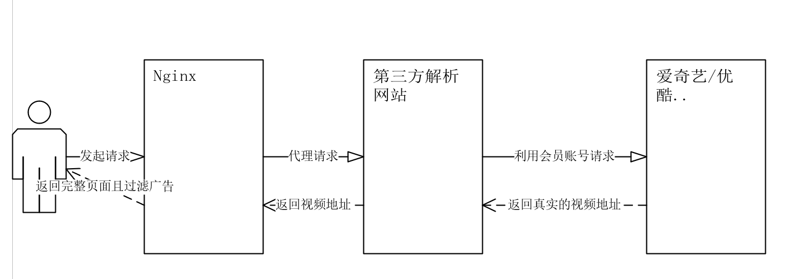
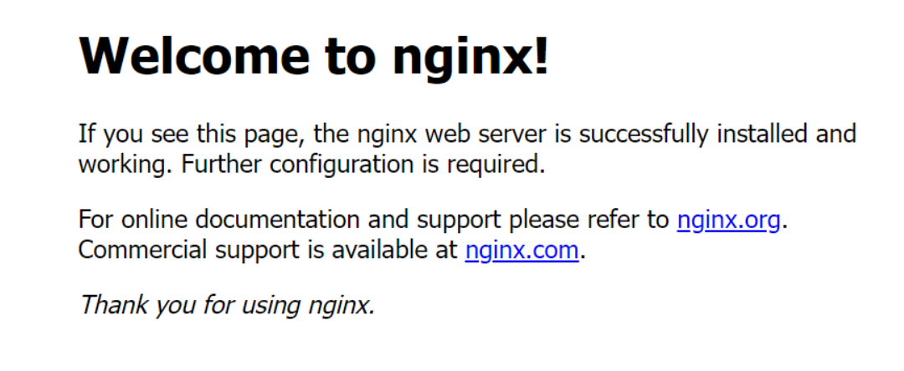
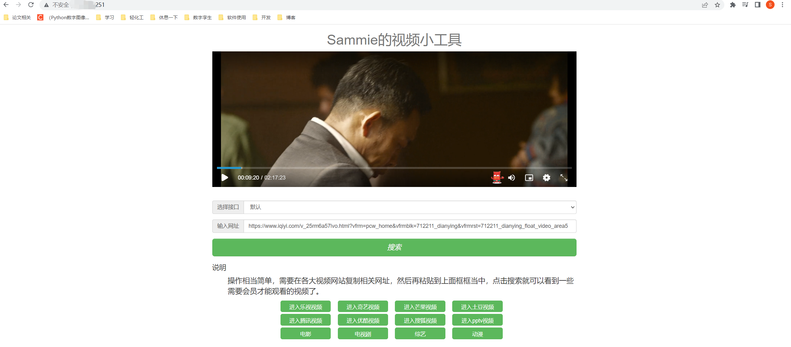

## 前言
因为想~~白嫖~~,不想给爱奇艺交钱，坚决抵制资本家持续涨价的行为，因此打算利用第三方的视频VIP解析网站和nginx来做一次代理，但是众所周知是这些视频VIP解析网站虽然免费但往往都带有一些广告或者不雅信息，因此我们可以利用nginx的sub_filter模块来进行过滤，并且可以将其中的一部分内容替换成自己的，同时为了方便管理我们使用docker来安装nginx。

## 技术原理

1. 整个访问流程：首先我们作为用户去访问我的网址(实际上是访问到了nginx)，然后nginx去访问目标站点(即第三方的视频解析网站)，最后将结果通过nginx过滤(过滤广告)后返回给我们用户，




2. 第三方视频解析网站的原理也很简单，那就是利用一个真实的会员账号登录以后得到其Cookie，每次带着Cookie去帮我们给视频网站请求真实的视频地址(一般是视频流)，当然为了防止被封一般第三方的视频解析网站会在同一个视频网站准备多个账号分别请求


## 安装Nginx

为了方便管理和维护，我们使用Docker容器技术进行安装(如何在Cetnos上安装Docker请自行谷歌)。

1. 拉取Nginx镜像
```shell
docker pull nginx
```
2. 创建Nginx配置文件
```shell
# 创建挂载目录
mkdir -p /home/nginx/conf
mkdir -p /home/nginx/log
mkdir -p /home/nginx/html
```
3. 复制配置文件到容器外部
```shell
# 生成容器 将内部容器的80端口映射到外部的80端口 云服务器防火墙记得放行80端口
docker run --name nginx -p 80:80 -d nginx
# 将容器nginx.conf文件复制到宿主机
docker cp nginx:/etc/nginx/nginx.conf /home/nginx/conf/nginx.conf
# 将容器conf.d文件夹下内容复制到宿主机
docker cp nginx:/etc/nginx/conf.d /home/nginx/conf/conf.d
# 将容器中的html文件夹复制到宿主机
docker cp nginx:/usr/share/nginx/html /home/nginx/
```
4. 启动运行
```shell
# 直接执行docker rm nginx或者以容器id方式关闭容器
# 找到nginx对应的容器id
docker ps -a
# 关闭该容器
docker stop nginx
# 删除该容器
docker rm nginx
# 删除正在运行的nginx容器 注意这个和上面一条的区别
docker rm -f nginx
```
```shell
docker run \
-p 80:80 \
--name nginx \
-v /home/nginx/conf/nginx.conf:/etc/nginx/nginx.conf \
-v /home/nginx/conf/conf.d:/etc/nginx/conf.d \
-v /home/nginx/log:/var/log/nginx \
-v /home/nginx/html:/usr/share/nginx/html \
-d nginx:latest

# 启动以后就可以按照docker ps 来查看所有正在运行中的docker镜像 同时修改外部配置文件也会自动映射到容器内的配置文件
```
5.效果图
当使用域名:端口号的组合在浏览器中访问后得到如下欢迎界面则算成功:



## 分析视频解析网站

这次我找到的第三方解析网站是766kan.com，主要原因是他本身简单些而且广告偏少，这样方便我们后续的过滤可以看到的是他本身也存在一些广告内容，而我们只需要借助nginx的配置文件中的sub_filter模块就可以过滤了，sub_filter的语法是 sub_filter or_string replace_string;

编辑nginx的外部配置文件 我的地址是/home/nginx/conf/conf.d/default.conf，修改为下面的内容：

```shell
vim /home/nginx/conf/conf.d/default.conf
```

```nginx
server {
    listen       80;
#    listen       443;
#    listen  [::]:80;
    server_name  localhost;

    #access_log  /var/log/nginx/host.access.log  main;

    location / {
       proxy_pass http://www.766kan.com;
       proxy_set_header Accept-Encoding '';
       sub_filter '<h3 class="text-center" style="font-weight: normal; color: #777">免费全网影视VIP视频vip会员免会员看电视剧电影！ 不能播放，可刷新更换接口！</h3>' '';
       sub_filter '<h1 class="text-center" style="font-weight: normal; color: #777">766看vip视频在线解析</h1>' '<h1 class="text-center" style="font-weight: normal; color: #777">Sammie的视频小工具</h1>';
       sub_filter '766kan是一家免费纯公益视频解析网站，我们是不存储视频以及相关录制服务，我们也不提供相关链接，如果您想要看免费资源，完全可以通过各大视频网站去搜索自己想要的节目，复制来到本站就可以享受到免费资源信息。' '';
       sub_filter '友情链接：' '';
       sub_filter '免费vps' '';
       sub_filter '手游传奇' '';
       sub_filter '网页传奇' '';
       sub_filter '搞笑图片' '';
       sub_filter '<li>Copyright © vip视频解析<script type="text/javascript" src="//js.users.51.la/21292185.js"></script></li>' '';
       sub_filter '<li>我们至力于服务于广大网友，搜索服务仅限网友学习用途，对于一些破坏视频版权行为，将坚决抵制这种行为。</li>'	 '';
       sub_filter '' '';
}

    location .*\.(js|css) {
        proxy_pass http://www.766kan.com;
        proxy_set_header Host $proxy_host;
        proxy_set_header X-Real-IP $remote_addr;
        proxy_set_header X-Forwarded-For $proxy_add_x_forwarded_for;
    }
}
```

其中，sub_filter是替换掉所有带广告的标签，这里可以直接查看源代码审查元素以后找到广告部分的代码，然后是我加了一行Accept-Encoding 这个是因为当你使用sub_filter会发现没起作用，原因是网站开启了gzip压缩模式。然后是下面的正则表达式，css和js文件由于是静态资源需要单独匹配，而且因为我们是代理，要把host和IP地址给带上才能把我们服务器的地址匹配到解析网站，否则访问到的就是xxx.com(我们的服务器)/xx.js而不是766kan.com/xx.js，这里要注意的一个点是不要随意在括号后面加$表示结束，因为很多css或者js文件会传参数来表示版本例如xxx.js?v=2022

## 常用的Nginx表达式规则

| 表达式      | 规则含义                                                     |
| ----------- | ------------------------------------------------------------ |
| ^           | 匹配输入字符串的起始位置                                     |
| $           | 匹配输入字符串的结束位置                                     |
| *           | 匹配前面的字符零次或多次。如“ol*”能匹配“o”及“ol”、“oll”      |
| +           | 匹配前面的字符一次或多次。如“ol+”能匹配“ol”及“oll”、“olll”，但不能匹配“o” |
| ?           | 匹配前面的字符零次或一次，例如“do(es)?”能匹配“do”或者“does”，”?”等效于”{0,1}” |
| .           | 匹配除“\n”之外的任何单个字符，若要匹配包括“\n”在内的任意字符，请使用诸如“[.\n]”之类的模式 |
| \           | 将后面接着的字符标记为一个特殊字符或一个原义字符或一个向后引用。如“\n”匹配一个换行符，而“$”则匹配“$” |
| \d          | 匹配纯数字                                                   |
| \w          | 匹配字母或数字或下划线或汉字                                 |
| \s          | 匹配任意的空白符                                             |
| \b          | 匹配单词的开始或结束                                         |
| {n}         | 重复 n 次                                                    |
| {n,}        | 重复 n 次或更多次                                            |
| {n,m}       | 重复 n 到 m 次                                               |
| []          | 定义匹配的字符范围                                           |
| [c]         | 匹配单个字符 c                                               |
| [a-z]       | 匹配 a-z 小写字母的任意一个                                  |
| [a-zA-Z0-9] | 匹配所有大小写字母或数字                                     |
| ()          | 表达式的开始和结束位置                                       |
| l           | 或运算符                                                     |

## location匹配

location是用来判断路径的，只写/表示根路径，还可以加/api/这样的路径表示的是域名下面的api路径例如www.xxx.com/api，而location匹配主要分为以下三类：

| 规则     | 表达式          |
| -------- | --------------- |
| 精准匹配 | location = / {} |
| 一般匹配 | location / {}   |
| 正则匹配 | location ~ / {} |

location常用的匹配规则

| 表达式 | 规则含义                                                     |
| ------ | ------------------------------------------------------------ |
| =      | 进行普通字符精确匹配，也就是完全匹配                         |
| ^~     | 表示普通字符匹配。使用前缀匹配。如果匹配成功，则不再匹配其它 location |
| ~      | 区分大小写的匹配                                             |
| ~*     | 不区分大小写的匹配                                           |
| !~     | 区分大小写的匹配取非                                         |
| !~*    | 不区分大小写的匹配取非                                       |

## 最终效果

最终我们就可以直接使用域名访问到去掉广告以后的VIP视频解析啦，而且因为是代理的别人的解析网站，这些网站为了吸引客户自己会不定时更新最新的解析接口，对我们来说也是舒服的一件事，没有任何广告还非常清晰，喜欢的话甚至可以直接全屏观看。


