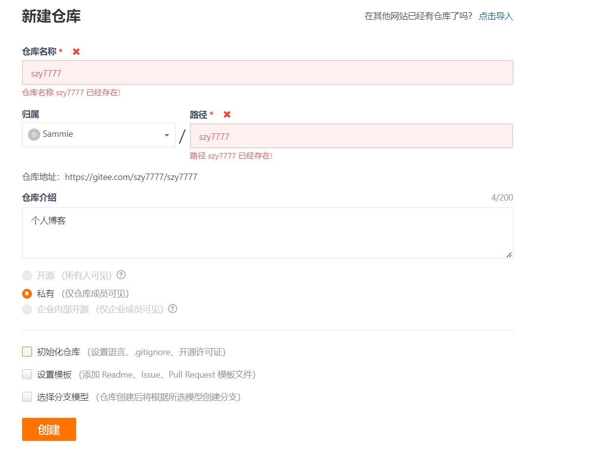
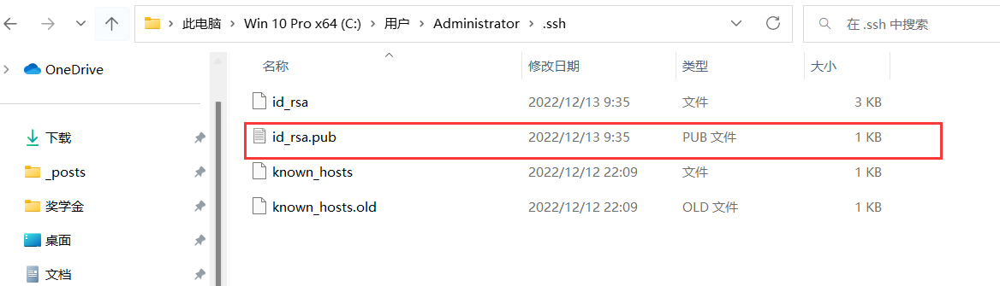
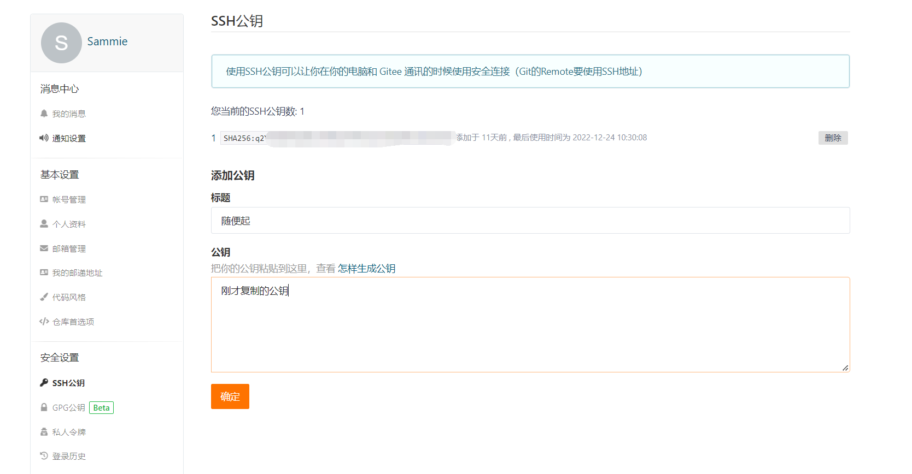
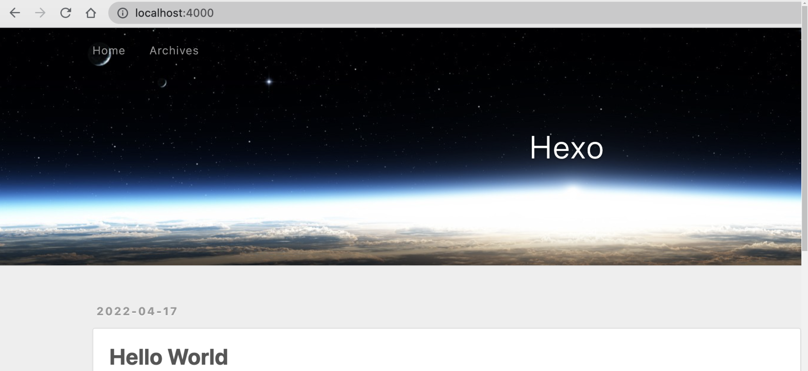
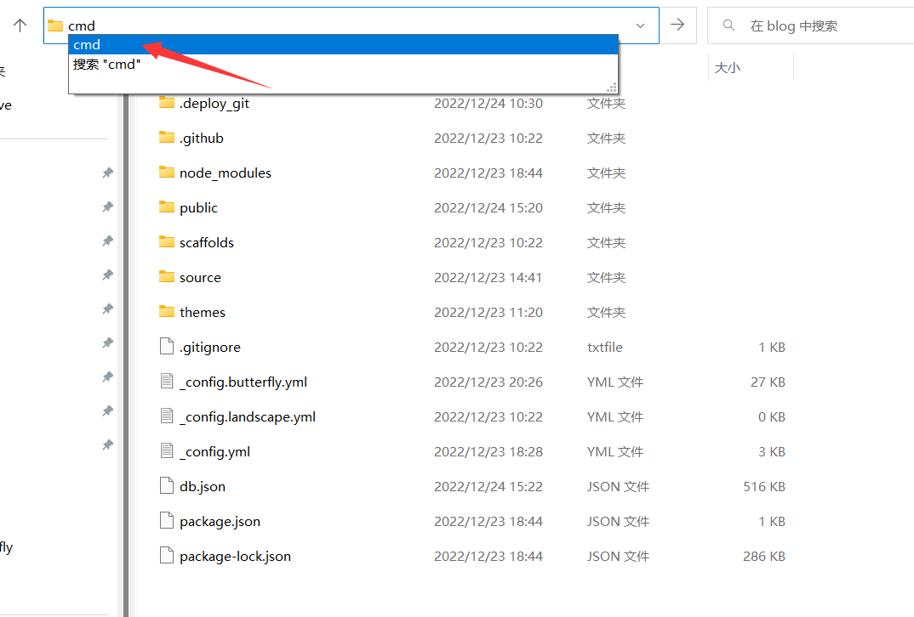
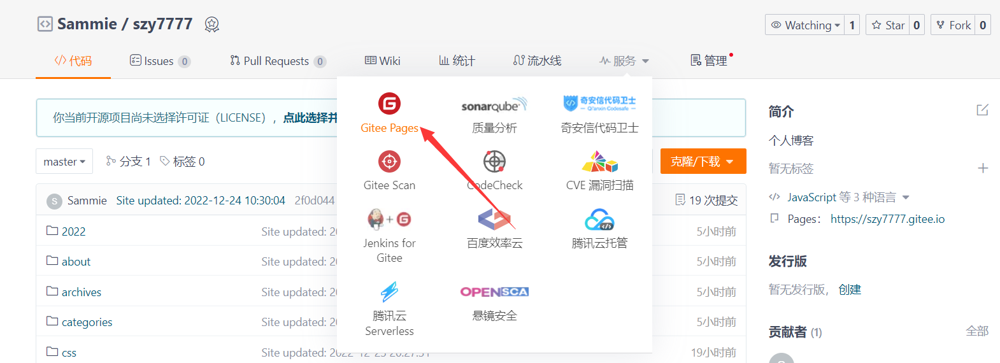
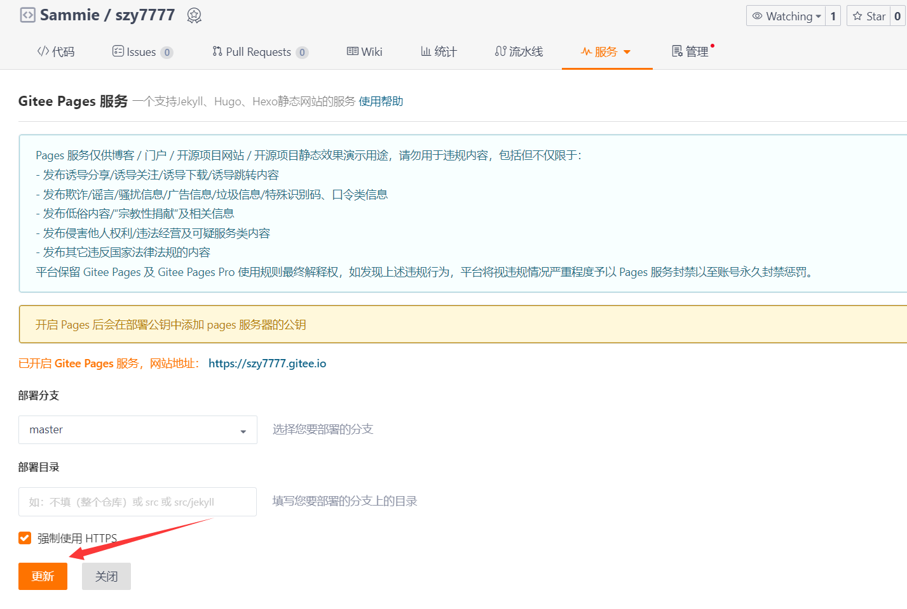
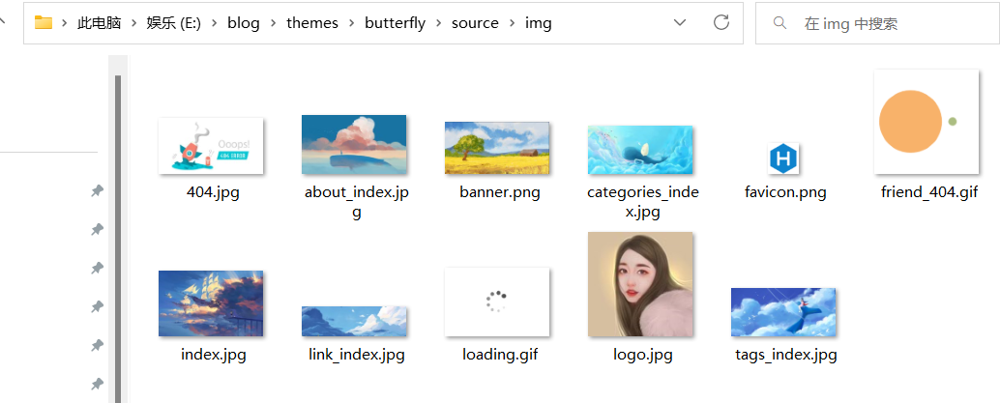
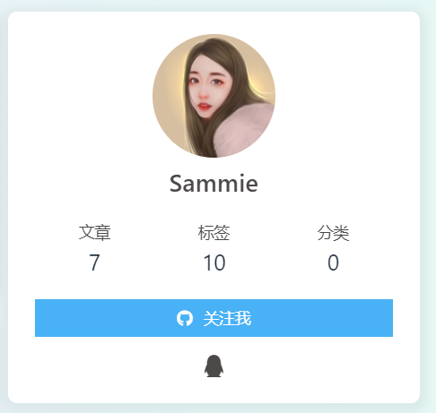

## 前言

因为一些原因本科时候写的博客直接被我清空掉了，虽然写的不好但是也是一种记录，说实话有点可惜，不过现在重新写也不晚，我是做后端但我很喜欢Hexo这种无后端的博客系统，而且我也有用markdown做笔记的习惯，因此使用Hexo来作为我的博客很合适，而BuffterFly这个主题也很符合我的审美， 所以这篇博客记录一下搭建过程（说实话配置项确实很多，不适合Hexo新手）

## 注册Gitee

如果不介意域名较长的问题的话，我们可以使用GiteePage来作为我们博客的存放地点和管理工具，这样我们不仅可以白嫖一个域名，同时还可以不需要购买服务器就可以存储我们博客编译以后的文件。

Gitee官网链接：[Gitee](https://gitee.com/)

注册好账号以后登录，选择创建仓库，由于Gitee本身给用户的首页是(用户名.gitee.io)，因此如果我们创建一个和用户名相同名称的仓库并使用这个仓库作为博客地址，是可以直接用(用户名.giee.io)，我的用户名是szy7777，所以仓库名称也是这个，因为我提前注册过了所以下面这里显示的是已经存在这个仓库了，注意创建好仓库以后去仓库设置里面把仓库设置成开源(没办法 Gitee的规定)



##  安装Git和Node.js

这部分内容属于基础性的内容，不在本篇博客的讨论范围，因此我就把网上其他人的教程放在下面链接里，按照链接里的内容安装即可，已经安装过这部分内容的同学可以直接忽略

1. [Git的安装教程，CSDN--头秃了怎么办](https://blog.csdn.net/weixin_44486583/article/details/122704375)
2. [Node.js详细安装+环境配置--博客园](https://www.cnblogs.com/wanpi/p/16119433.html)

注意第二部分的node安装的时候要按照教程配置一下镜像地址，因为node官方本身的镜像地址在国外，不配置淘宝地址的话很容易在今后的使用中下载模块很慢或者直接失败

## 配置SSH公钥

Gitee提供了基于SSH协议的Git服务，我们可以使用SSH的方式来提交我们Hexo编译后的文件，这样我们提交编译后的文件就不用再输入账号和密码,用管理员权限打开cmd命令提示符，输入以下内容(注意#号后面是我写的注释不要粘贴过去了)：

```shell
git config --global user.name   # 查看git用户名
git config --global user.email  # 查看git邮箱

git config --global user.name 'abc' # 设置你的用户名
git config --global user.email abc@qq.com # 设置你的邮箱

ssh-keygen -t rsa -C "abc@qq.com" # 生成ssh公钥 邮箱填刚才上面设置的邮箱地址
```

生成好了ssh以后默认是在C:\Users\sammie\.ssh(sammie是各自的用户名)，记得在文件夹设置里面把隐藏文件夹打开，然后找到id_rsa.pub，用文本文档打开它然后复制里面的内容，等下我们要使用



然后到Gitee中，点击设置中的安全设计选择SSH公钥，标题随便起，然后把刚才复制的公钥粘贴到这里面去，点击确定即可，我这里配置过了



打开命令提示符，输入以下指令，如果看到下面的内容就是成功了！

```shell
ssh -T git@gitee.com
# 显示如下内容
# 表示连接成功
Hi “您的用户名”! You've successfully authenticated, but GitHub does not provide shell access.
```

## 安装Hexo

首先在电脑上随便选个地方创建一个文件夹，例如我是E:/blog,然后开始安装hexo

```shell
npm install -g hexo # 利用npm 安装hexo
```

初始化hexo

```shell
cd blog # 进入blog目录
hexo init blog # 初始化
npm install # 安装hexo所需的文件 
```

初始化以后的目录以及作用：

```shell
.
├── .deploy       #需要部署的文件
├── node_modules  #Hexo插件
├── public        #生成的静态网页文件 实际上传git的内容
├── scaffolds     #模板
├── source        #博客正文和其他源文件等都应该放在这里
|   ├── _drafts   #草稿 版本不同可能不存在这一项
|   └── _posts    #文章
├── themes        #主题
├── _config.yml   #全局配置文件
└── package.json  #依赖包配置项
```

启动hexo的命令（以后写完博客就可以这样启动在本地看效果，具体如何推送后面会介绍）：

```shell
hexo clean # 清除所有之前编译好后的内容 简化命令 hexo c
hexo generate # 重新生成静态网页 也可以使用简化命令 hexo g
hexo server # 启动本地服务 可以在本地看效果 简化命令 hexo s
```

然后使用浏览器访问 http://localhost:4000,看到下面的效果就说明成功运行了。



下面我们准备部署博客到Gitee上面去，先回到博客的根目录下，找到hexo的配置文件_config.yml，打开它编辑，找到下面的配置项，如果没有的话手动添加一下就行

```yaml
# URL
url: http://szy7777.gitee.io # 配置git路径 具体参见https://gitee.com/help/articles/4136
deploy:
  type: git                        # type为git
  repo: git@gitee.com:XXXXXX/szy7777.git  # 仓库的 URL 可以在gitee中找到仓库后复制
  branch: master
```

回到博客的根目录下，打开命令提示符，不会cd命令的小伙伴直接在最上面路径输入cmd回车即可，然后输入以下命令：



```shell
npm install hexo-deployer-git --save # 安装自动部署工具 这一步是必须的
```

新生成一篇博客，生成的博客会在source/_posts路径下，直接编辑对应的md文件即可

```shell
hexo new welcome # welcome是生成的文件名 也会是新博客的默认标题
```

打开welcome.md 开始编辑，注意markdown的语法，markdown的具体语法请自行搜索谷歌，注意tags可以用来标记标签，这样这篇博客就可以通过标签分类，也可以写categories来分类，但我一般不使用categories。在虚线后的就是博客的写作区域。

```markdown
title: welcome 
date: 2022-12-24 10:03:28
tags: ['Hexo','技术应用']  
```

重新执行hexo部署命令，推送到Gitee

```shell
hexo clean # 清除之前生成的静态页面
hexo g # 重新生成静态页面
hexo d # 推送到gitee 以后每次写完都用这三个命令来推送
```

打开GiteePages服务，更新部署，注意每次推送以后都要来这里手动更新才会生效，所以我建议尽量多写一点内容再推送。





等待部署，当出现已开启Gitee Page服务的时候，使用后面给的地址直接进行公网访问！

## 开启Hexo图片上传

由于我们的博客经常会使用到图片，因此我们需要一个图片上传的插件，在hexo目录下打开cmd，输入以下命令：

```shell
npm install hexo-asset-image --save # 使用hexo-asset-image插件
```

然后找到hexo根目录下的_config.yml，修改

```yaml
post_asset_folder: true # 开启文章文件夹生成 这样每次生成新文章的时候都会创建一个同名文件夹
```

 在node_modules下的hexo-asset-image文件夹下找到index.js修改为以下代码

```js
'use strict';
var cheerio = require('cheerio');

// http://stackoverflow.com/questions/14480345/how-to-get-the-nth-occurrence-in-a-string
function getPosition(str, m, i) {
  return str.split(m, i).join(m).length;
}

hexo.extend.filter.register('after_post_render', function(data){
  var config = hexo.config;
  if(config.post_asset_folder){
    var link = data.permalink;
    var beginPos = getPosition(link, '/', 3) + 1;
    var appendLink = '';
    // In hexo 3.1.1, the permalink of "about" page is like ".../about/index.html".
    // if not with index.html endpos = link.lastIndexOf('.') + 1 support hexo-abbrlink
    if(/.*\/index\.html$/.test(link)) {
      // when permalink is end with index.html, for example 2019/02/20/xxtitle/index.html
      // image in xxtitle/ will go to xxtitle/index/
      appendLink = 'index/';
      var endPos = link.lastIndexOf('.');
    }
    else {
      var endPos = link.lastIndexOf('/');
    }
    link = link.substring(beginPos, endPos) + '/' + appendLink;

    var toprocess = ['excerpt', 'more', 'content'];
    for(var i = 0; i < toprocess.length; i++){
      var key = toprocess[i];

      var $ = cheerio.load(data[key], {
        ignoreWhitespace: false,
        xmlMode: false,
        lowerCaseTags: false,
        decodeEntities: false
      });

      $('img').each(function(){
        if ($(this).attr('src')){
          // For windows style path, we replace '\' to '/'.
          var src = $(this).attr('src').replace('\\', '/');
          if(!(/http[s]*.*|\/\/.*/.test(src)
            || /^\s+\//.test(src)
            || /^\s*\/uploads|images\//.test(src))) {
            // For "about" page, the first part of "src" can't be removed.
            // In addition, to support multi-level local directory.
            var linkArray = link.split('/').filter(function(elem){
              return elem != '';
            });
            var srcArray = src.split('/').filter(function(elem){
              return elem != '' && elem != '.';
            });
            if(srcArray.length > 1)
            srcArray.shift();
            src = srcArray.join('/');

            $(this).attr('src', config.root + link + src);
            console.info&&console.info("update link as:-->"+config.root + link + src);
          }
        }else{
          console.info&&console.info("no src attr, skipped...");
          console.info&&console.info($(this));
        }
      });
      data[key] = $.html();
    }
  }
});
```

从此以后每次都可以用hexo new 文章名来创建新文章的时候，会自动生成一个同名文件夹，这篇文章的所有图片都放到这个文件夹下，然后在md文件中使用以下语法来引用图片:

```markdown
 #例如

```

## 开启图片懒加载

由于在后续的主题配置或者是平常我们的写作当中存在较多的图片，这些图片很占用带宽，如果一次性加载的话会很慢，因此我们可以借助图片懒加载插件来进行懒加载，只有当滑动到图片所在位置的时候才会开始加载图片。注意下面的loading.gif可以自己去找网图。

安装hexo-lazyload-image插件

```shell
npm install hexo-lazyload-image --save
```

编辑_config.yml，开启插件，onlypost表示路由和文章页才懒加载，设置为false表示全局懒加载

```yaml
# 图片懒加载
lazyload:
  enable: true
  loadingImg: /img/loading.gif # 注意这张图片放到主题的sourece/img/ 目录下 主题在下一章介绍
  onlypost: false
```

## 启用ButterFly主题

Hexo默认自带的主题是landscape，我个人觉得不是很好看，所以我这个博客使用的是目前比较流行的ButterFly主题，由于这个主题的功能较多，因此配置项也很多，所以配置的时候需要多点耐心，如果觉得麻烦可以建议搜索Next主题也不错。

### 安装ButterFly主题

到hexo根目录下启动cmd命令提示符，输入以下命令安装主题(完成下载后你会发现thme下多了个文件夹就是butterfly)：

```shell
git clone -b master https://github.com/jerryc127/hexo-theme-butterfly.git themes/butterfly
```

下载pug以及stylus渲染器

```shell
npm install hexo-renderer-pug hexo-renderer-stylus --save
```

下载本地搜索插件

```shell
npm install hexo-generator-search --save
```

修改_config.yml文件，切换主题为butterfly

```yaml
# Extensions
# theme: landscape 原有的主题 直接用#注释掉
theme: butterfly
```

然后打开\themes\butterfly下的`_config.yml`(注意不是根目录下哪个，是主题里面的这个)，复制里面的内容，然后回到根目录下，创建`_config.butterfly.yml`，然后把复制的内容粘贴进去，以后修改主题的配置就修改这个文件

Hexo会自动合并主题中的`_config.yml`和 `_config.butterfly.yml`里的配置，如果存在同名配置，会使用`_config.butterfly.yml`的配置，其优先度较高。

然后修改根目录下的`_config.yml`，修改网站的各种资料，例如标题，语言等

```yaml
# Hexo Configuration
## Docs: https://hexo.io/docs/configuration.html
## Source: https://github.com/hexojs/hexo/

# Site
title: SammieBlog 	#标题
subtitle: ''	#副标题
description: #个性签名
keywords:
author: Sammie	#作者
language: zh-CN	#语言
timezone: Asia/Shanghai    #中国的时区
```

### 配置ButterFly主题

打开根目录下的`_config.butterfly.yml`，逐步修改其中的参数，注意这里参数比较多，要有点耐心！

修改博客右上角的菜单栏，修改完下面的内容以后先保存一下，因为tags、about、link这三个页面需要自己单独设置一下

```yaml
menu:
   主页: / || fas fa-home
   文章 || fa fa-graduation-cap:
     归档: /archives/ || fas fa-archive
     标签: /tags/ || fas fa-tags
#    分类: /categories/ || fas fa-folder-open
#   生活||fas fa-list:
#     音乐: /music/ || fas fa-music
#     影视: /movies/ || fas fa-video
   友链: /link/ || fas fa-link
   关于我: /about/ || fas fa-heart
```

配置tags、link、about页面，打开cmd命令提示符，输入以下命令:

```shell
hexo new page tags
hexo new page link
hexo new page about
```

分别在source找到这三个文件夹中的index.md文件，打开编辑

```markdown
title: 标签
date: 2022-12-23 12:05:47
type: tags
```

```markdown
title: 友情链接
date: 2022-12-23 12:10:30
type: link
```

```markdown
title: 关于我
date: 2022-10-13 17:51:17
type: about
```

以后想修改关于我这个界面的内容就直接到/about/index.md当中修改即可，下面重点介绍一下友情链接的添加方式：

在 Hexo 博客目录中的 `source/_data`，创建一个文件 `link.yml`
```yaml
YAMLclass:
  class_name: 友情链接
  link_list:
    1:
      name: Sammie的博客
      link: https://szy7777.gitee.io
      avatar: https://img.antmoe.com/avatar.png
      descr: 后端同学
    2:
      name: test
      link: https://www.xxxxxxcn/
      avatar: https://xxxxx/avatar.png
      descr: test  
class2:
   class_name: 链接无效
   link_list:
     1:
       name: test
       link: https://blog.xxx.com
       avatar: https://img.antmoe.com/avatar.png
       descr: test
```

然后回到`_config.butterfly.yml`，继续编辑其他内容

代码块显示设置，会在代码块的右上角出现一个可以复制的按钮

```yaml
highlight_copy: true
highlight_shrink: false #代码框展开
# Code Blocks (代码块样式)
# --------------------------------------
highlight_theme: mac #  darker / pale night / light / ocean / mac / mac light / false
highlight_copy: true # copy button 是否显示复制按钮
highlight_lang: true # show the code language 展示代码块语言
highlight_shrink: false # true: 打开文章默认折叠代码块内容 / false: 打开文章默认展开代码块内容
highlight_height_limit: false # unit: px
code_word_wrap: false #是否关闭滚动条
```

启动本地搜索

```yaml
# Local search
local_search:
  enable: true
  labels:
    input_placeholder: 搜索文章 # 搜索框提示
    hits_empty: "什么内容都没搜索到: ${query}" # 如果没有查到内容相关内容显示
```

修改副标题

```yaml
# the subtitle on homepage (主頁subtitle)
subtitle:
  enable: true
  # Typewriter Effect (开启打字效果)
  effect: true
  # loop (循環打字)
  loop: false
  # source調用第三方服務
  # source: false 關閉調用
  # source: 1  調用搏天api的隨機語錄（簡體）
  # source: 2  調用一言網的一句話（簡體）
  # source: 3  調用一句網（簡體）
  # source: 4  調用今日詩詞（簡體）
  # subtitle 會先顯示 source , 再顯示 sub 的內容
  source: false
  # 如果有英文逗号' , ',请使用转义字元 &#44;
  # 如果有英文双引号' " ',请使用转义字元 &quot;
  # 开头不允許转义字元，如需要，请把整個句子用双引号包住
  # 如果关闭打字效果，subtitle只会现示sub的第一行文字
  sub:
    - 不卑不亢,不嗔不恨,不骄不躁,不气不馁|
```

图片设置，所有的配置图片放到/themes/butterfly/source/img下



1. 网站图标
```yaml
# Favicon（网站图标）
favicon: /img/logo.jpg
```
2. 头像
```yaml
avatar:
  img: /img/logo.jpg #图片路径
  effect: false #头像会一直转圈  
```
3. 主页封面图片
```yaml
# The banner image of home page
index_img: /img/index.jpg
```
4. 文章详情页顶部图片
```yaml
# 当没有在front-matter设置top_img和cover的情况下会显示该图
# If the banner of page not setting, it will show the top_img
default_top_img: /img/categories_index.jpg #我设置的本地图片
```
5. 归档页顶部图片
```yaml
#归档子标签页图片
# The banner image of archive page
archive_img: /img/archive.jpg
```
6. tag页顶部图
```yaml
#tag页（标签页）
# If the banner of tag page not setting, it will show the top_img
# note: tag page, not tags page (子標籤頁面的 top_img)
tag_img: /img/tags_index.jpg
```

7. 文章封面
```yaml
# 每篇文章都可以设置一张封面，可以为每篇文章设置默认封面
# 也可以修改每个md文件的front-matter的cover属性，会覆盖上面的默认封面。
cover:
  index_enable: true #  是否展示文章封面
  aside_enable: true
  archives_enable: true
  position: both # 封面展示的位置 left/right/both
  # 当没有设置cover时，默认展示的文章封面
  default_cover:
    # 当配置多张图片时，会随机选择一张作为 cover. 此时写法为
    - https:
    - http:
```

侧边栏样式修改

1. 调整侧边栏出现的位置
```yaml
aside:
  enable: true
  hide: false
  button: true
  mobile: true # display on mobile
  position: right # left or right 我的是右边
```
2. 个人信息
```yaml
...
card_author:
    enable: true
    description:  # 描述
    button:
      enable: true
      icon: fab fa-github
      text: 关注我 #按钮文字
      link: https://github.com/xxxxxx #可以放上自己的github地址
```
```yaml
# social settings (社交圖標設置)
# formal:
#        icon: link || the description
#书写格式：图标名：url || 描述性文字`
social:
   fab fa-qq:  tencent://AddContact/?fromId=45&fromSubId=1&subcmd=all&uin=825552510&website=www.oicqzone.com || QQ
#   fas fa-envelope-open-text: mailto:825552510@qq.com || Email
```


效果图：


3. 公告栏设置
```yaml
...
card_announcement:
    enable: true
    content: 欢迎大佬们互换友链，期待大家内推我 #修改公告栏信息
```
4. Toc目录
```yaml
# toc (目錄)
toc:
  enable: true
  number: true # 自动开启父子标题序列号
  #style_simple: false
  auto_open: true # 自动展开子栏
```

修改网站背景

博客的背景默认是白色的，如果你想换成和我一样的背景渐变色，你可以先在`\theme\butterfly\source\css\`目录下创建一个`background.css`，然后把下面的内容复制进去保存：

```css
//代码百度得来
#web_bg {
  background: -webkit-linear-gradient(
    0deg,
    rgba(247, 149, 51, 0.1) 0,
    rgba(243, 112, 85, 0.1) 15%,
    rgba(239, 78, 123, 0.1) 30%,
    rgba(161, 102, 171, 0.1) 44%,
    rgba(80, 115, 184, 0.1) 58%,
    rgba(16, 152, 173, 0.1) 72%,
    rgba(7, 179, 155, 0.1) 86%,
    rgba(109, 186, 130, 0.1) 100%
  );
  background: -moz-linear-gradient(
    0deg,
    rgba(247, 149, 51, 0.1) 0,
    rgba(243, 112, 85, 0.1) 15%,
    rgba(239, 78, 123, 0.1) 30%,
    rgba(161, 102, 171, 0.1) 44%,
    rgba(80, 115, 184, 0.1) 58%,
    rgba(16, 152, 173, 0.1) 72%,
    rgba(7, 179, 155, 0.1) 86%,
    rgba(109, 186, 130, 0.1) 100%
  );
  background: -o-linear-gradient(
    0deg,
    rgba(247, 149, 51, 0.1) 0,
    rgba(243, 112, 85, 0.1) 15%,
    rgba(239, 78, 123, 0.1) 30%,
    rgba(161, 102, 171, 0.1) 44%,
    rgba(80, 115, 184, 0.1) 58%,
    rgba(16, 152, 173, 0.1) 72%,
    rgba(7, 179, 155, 0.1) 86%,
    rgba(109, 186, 130, 0.1) 100%
  );
  background: -ms-linear-gradient(
    0deg,
    rgba(247, 149, 51, 0.1) 0,
    rgba(243, 112, 85, 0.1) 15%,
    rgba(239, 78, 123, 0.1) 30%,
    rgba(161, 102, 171, 0.1) 44%,
    rgba(80, 115, 184, 0.1) 58%,
    rgba(16, 152, 173, 0.1) 72%,
    rgba(7, 179, 155, 0.1) 86%,
    rgba(109, 186, 130, 0.1) 100%
  );
  background: linear-gradient(
    90deg,
    rgba(247, 149, 51, 0.1) 0,
    rgba(243, 112, 85, 0.1) 15%,
    rgba(239, 78, 123, 0.1) 30%,
    rgba(161, 102, 171, 0.1) 44%,
    rgba(80, 115, 184, 0.1) 58%,
    rgba(16, 152, 173, 0.1) 72%,
    rgba(7, 179, 155, 0.1) 86%,
    rgba(109, 186, 130, 0.1) 100%
  );
}
```

然后修改`_config.butterfly.yml`，修改引入方式:

```yaml
# Inject
# Insert the code to head (before '</head>' tag) and the bottom (before '</body>' tag)
# 插入代码到头部 </head> 之前 和 底部 </body> 之前
inject:
  head:
     - <link rel="stylesheet" href="/css/background.css">
  bottom:
    # - <script src="xxxx"></script>
```

注意：如果此时背景色并未生效，尝试在_config.butterfly.yml文件中添加以下内容

```yaml
# Website Background (設置網站背景)
# can set it to color or image (可設置圖片 或者 顔色)
# The formal of image: url(http://xxxxxx.com/xxx.jpg)
background: '#efefef'
```

修改footer背景，开启以后会和顶部的图片保持一致，还可以设置底部的自定义文字

```yaml
# footer是否显示图片背景(与top_img一致)
footer_bg: true
footer:
  owner:
    enable: true
    since: 2020
  custom_text: '世上最幸运的事就是喜欢上一个人'
  copyright: true # Copyright of theme and framework
```

背景特效，开启后可以在背景设置动态或者静态的彩带，或者是星空特效，我默认都没开启，你可以把其中一个设置成true

```yaml
# Background effects (背景特效)
# --------------------------------------

# canvas_ribbon (静止彩带)
# See: https://github.com/hustcc/ribbon.js
canvas_ribbon:
  enable: false  #开启设置成true
  size: 150
  alpha: 0.6
  zIndex: -1
  click_to_change: false
  mobile: false

# Fluttering Ribbon (动态彩带)
canvas_fluttering_ribbon:
  enable: false
  mobile: false

#星空特效
# canvas_nest
# https://github.com/hustcc/canvas-nest.js
canvas_nest:
  enable: false
  color: '0,0,255' #color of lines, default: '0,0,0'; RGB values: (R,G,B).(note: use ',' to separate.)
  opacity: 0.7 # the opacity of line (0~1), default: 0.5.
  zIndex: -1 # z-index property of the background, default: -1.
  count: 99 # the number of lines, default: 99.
  mobile: false
```

文章分享功能

```yaml
# Share System (分享功能)
# --------------------------------------

# AddThis
# https://www.addthis.com/
addThis:
  enable: false
  pubid:  #访问 AddThis 官网, 找到你的 pub-id

# Share.js
# https://github.com/overtrue/share.js
sharejs:
  enable: true  #我开启的
  sites: facebook,twitter,wechat,weibo,qq  #想要显示的内容

# AddToAny
# https://www.addtoany.com/
addtoany:
  enable: false
  item: facebook,twitter,wechat,sina_weibo,facebook_messenger,email,copy_link
```

开启评论功能

我使用的是valine的评论，因此需要先去LeanCloud注册一个账号，注册好以后创建开发者应用，然后复制`appID`和`appKey`，最后写入到`_config.butterfly.yml`

[LeanCloud登录注册地址](https://console.leancloud.cn/login)

```yaml
# valine
# https://valine.js.org
valine:
  appId: 你的appId # leancloud application app id
  appKey: 你的appKey # leancloud application app key
  avatar: monsterid # gravatar style https://valine.js.org/#/avatar
  pageSize: 10 # comment list page size
  lang: zh-CN # i18n: zh-CN/zh-TW/en/ja
  placeholder: 记得留下你的昵称和邮箱....可以快速收到回复 # valine comment input placeholder(like: Please leave your footprints )
  guest_info: nick,mail,link #valine comment header info (nick/mail/link)
  recordIP: false # Record reviewer IP
  serverURLs: # This configuration is suitable for domestic custom domain name users, overseas version will be automatically detected (no need to manually fill in)
  enableQQ: true # enable the Nickname box to automatically get QQ Nickname and QQ Avatar
  requiredFields: nick,mail # required fields (nick/mail)
  visitor: false
```

美化页面展示，开启后文章页标题左边会出现一个链接符号，但注意不是锚点只是起到装饰作用，锚点是在标题的右边我不建议开启
```yaml
# Beautify (美化頁面顯示)
beautify:
  enable: true
  field: site # site/post
  title-prefix-icon: # '\f0c1'
  title-prefix-icon-color: # '#F47466'
```
```yaml
# 锚点 不建议开启 没什么用还很难看
anchor:
  button:
    enable: false
    always_show: flase
    icon: # the unicode value of Font Awesome icon, such as '\3423'
  auto_update: false # when you scroll in post, the URL will update according to header id.
```

## 结束语

OK到这里就大功告成了！ButterFly不太适合第一次玩Hexo的新手，或者就是要有点耐心才行，以后我会持续更新我的博客，不管写的好不好都是一种学习的记录。
